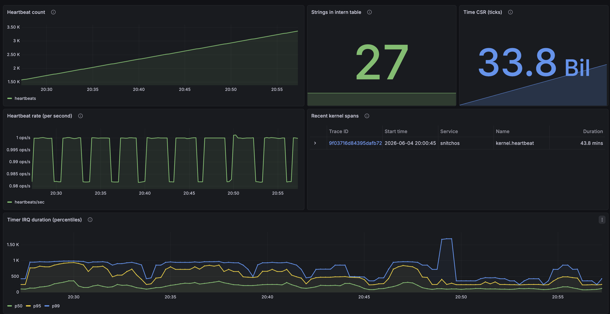
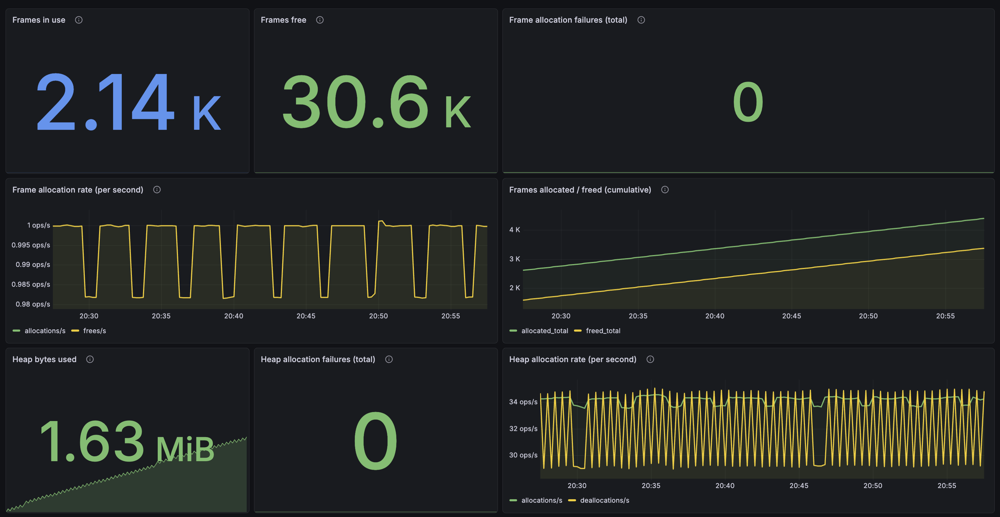
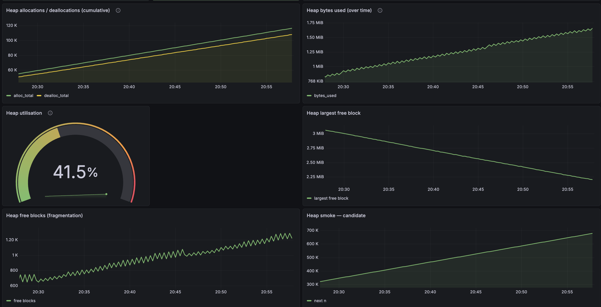

# snitchos

The operating system that snitches on itself 🐀







## Status

**v0.1 "Hello, traced world"** — _complete_. Kernel boots on RISC-V in QEMU, emits a structured boot-phase span tree over a dedicated virtio-console channel, host-side collector decodes and prints.

**v0.2 "Grafana arrives"** — _complete_. Tempo + Prometheus + Grafana stack via docker-compose; collector exports OTLP traces + serves Prometheus `/metrics`; provisioned dashboard shows live kernel telemetry.

**v0.3 "Interrupts & clock"** — _complete_. Full S-mode trap handling (entry/exit asm + Rust dispatcher); SSTC-based timer interrupts; heartbeat is timer-driven (`wfi` between ticks) instead of busy-spin. First histogram metric (`snitchos.irq.timer.duration_ticks`) end-to-end through the collector's bucket accumulation into Grafana.

**v0.3.1 "Making the kernel testable"** — _complete_. Carved out `kernel-core` (host-buildable `no_std` library) holding the intern table, span registry, pre-init buffer, scause decoding, and the `FrameSink`/`Clock` traits. 29 host unit tests over the data logic. New `xtask test` harness boots the kernel in QEMU, decodes the virtio-console telemetry stream, asserts on the `Frame` sequence — 3 scenarios passing in ~5s wallclock. See [posts/post-8-making-the-kernel-testable.md](posts/post-8-making-the-kernel-testable.md).

**v0.4 "Memory"** — _complete_. Five steps:

- **Steps 1–3.** Sv39 paging on, dual-mapped boot table, kernel relinked at higher-half VAs with PC trampoline + identity unmap, `va_to_pa` at every device-DMA site so virtio still works. 1 GiB Sv39 huge-page leaf installs a linear map of all physical RAM at `0xffffffd0_00000000+` so any allocated frame has a kernel-reachable VA via `pa_to_kernel_va`. Bitmap-based frame allocator in `kernel_core::frame` with O(1) free-count + short-circuit; kernel-side `frame::{alloc, alloc_zeroed, free, stats}` API; DTB-driven init reserving SBI / kernel image / DTB regions. Five `snitchos.frames.*` metrics drive five Grafana panels including an OOM curve under the `oom-leak` feature.
- **Step 4 (kernel heap).** `#[global_allocator]` backed by `linked_list_allocator` (locally forked for `Heap::free_block_stats` so fragmentation is observable). Initial 4 MiB heap; `Box` / `Vec` / `String` / `BTreeMap` work inside the kernel. Telemetry: `snitchos.heap.{alloc_total, dealloc_total, alloc_failed_total, bytes_capacity, bytes_used, bytes_free, grow_total, grow_failed_total, free_blocks, largest_free_block_bytes}`.
- **Step 5 (runtime page-table mutation + growable heap).** `kernel::mmu::map(va, pa, perms)` walks Sv39 from `BOOT_PT_ROOT` to the leaf, allocating intermediate tables via the frame allocator on demand, `sfence.vma`'ing on success. Walk logic in `kernel_core::mmu::map` is pure and host-tested via a `PtMem` mock (11 tests). P2 migrates the heap to a dedicated 1 GiB VA window at `HEAP_VA_BASE = 0xffffffc0_00000000`; `heap::extend` grows under a heartbeat-driven watermark policy (extracted to `kernel_core::heap::watermark_grow_decision`, 6 host tests).

See [posts/post-9-moving-the-kernel-without-breaking-it.md](posts/post-9-moving-the-kernel-without-breaking-it.md), [posts/post-10-frame-by-frame.md](posts/post-10-frame-by-frame.md), and [posts/post-11-boxes.md](posts/post-11-boxes.md).

**v0.5 "Threading & round-robin scheduler"** — _complete_. Cooperative round-robin scheduler over a single CPU; four kernel threads at boot (main, idle, task_a, task_b). `Task` struct + `Scheduler` + asm context switch in `kernel::sched`; pure-data shape (Runqueue, TaskState) in `kernel_core::sched`. New wire frames: `ThreadRegister` and `ContextSwitch{reason}`; `SpanStart` gains `task_id`. Per-task `SpanCursor` swapped on context switch so spans can survive yields without parent-chain corruption. Per-task `cpu_time_ticks` + `runs_total` metrics on the wire; Grafana thread-timeline + active-threads + switches/sec + yield-overhead percentiles. SMP-prep pre-factor before threading: `kernel::sync::{Mutex, Once}` chokepoint + `kernel::percpu::PerCpu<T>` stub + clippy `disallowed_types` lint blocks raw `spin::Mutex` outside `kernel::sync`. See [posts/post-12-the-kernel-takes-turns.md](posts/post-12-the-kernel-takes-turns.md).

**v0.6 "Cooperative SMP"** — _complete_. Three-post arc landing at a producer/consumer workload migrated across two harts.

- **Step 1 (cooperative single-hart baseline)** — _complete_. Producer/consumer histogram workload: `kernel::sync::Mutex<VecDeque<u64>>` queue, `[AtomicU64; 64]` histogram, pure-logic `Lcg` / `bin_of` / `bin_sample` in `kernel_core::workload` (8 host tests). Five metrics drive the new "Workload" Grafana section. See [posts/post-13-producer-consumer-baseline.md](posts/post-13-producer-consumer-baseline.md).
- **Steps 3–10 (SMP infrastructure)** — _complete_. Hart 1 boots. Wire format adds `hart_id: u8` to `SpanStart` + `ContextSwitch` and a new `HartRegister { id, mhartid, role }` variant (`PROTOCOL_VERSION` 1→2). `tp` register convention + `PerHartData[MAX_HARTS]` with cacheline-aligned slots; `CURRENT_TASK` / `CURRENT_TASK_ENTRY_TICK` / `CURRENT_SPAN_CURSOR` lifted into `PerCpu<T>`. IPI primitive over SBI `sPI` extension; `IpiMessage` bitflags (`Wakeup`, `TlbShootdown`); receive-side trap-dispatcher; first `Release`/`Acquire` pair the kernel uses. SBI HSM bring-up (`sbi::hart_start`); `_secondary_start` asm sets up SP + SATP + trampoline; `secondary_main` enrolls as `hart_1_main` and runs an idle yield/wfi loop. TLB shootdown slots + receive-side handler + initiator (`mmu::shootdown(va)`); per-(hart) `shootdown_va` / `shootdown_ack`; second cross-hart handshake. Per-hart runqueue + `spawn_on(hart, name, entry)` + cross-hart `IPI_WAKEUP`. Weak-memory audit documented every kernel atomic. SMP visibility on the system dashboard (`Harts online`, `Boot hart mhartid`, `Secondary hart wfi rate`). Six bugs caught by the integration suite along the way (linker section collision, mhartid-vs-logical-id translation, `CURRENT_TASK` seeding, intern-table overflow, asm stack-pointer dereference, virtio TX staging requirement). See [posts/post-14-hart-1-wakes-up.md](posts/post-14-hart-1-wakes-up.md).
- **Step 11 (workload consumer migrates to hart 1)** — _complete_. `workload=smp` runs the producer on hart 0 and the consumer on hart 1 over the shared `Mutex<VecDeque>` queue; the cross-hart correctness oracle (`histogram_sum >= samples_consumed` across the boundary) is hardened with `Release`/`Acquire` guards. The chokepoint earns its keep.
- **Step 12 (`Mutex<VecDeque>` → `heapless::spsc::Queue`)** — _complete_. The lock-free SPSC queue retires the chokepoint; the counter-intuitive result ("lock-free made it slower" at low contention) is [post 19](posts/post-19-lock-free-made-it-slower.md).
- **Steps 13–14 (integration suite + closeout)** — _complete_. SMP scenarios: `smp-producer-consumer-correctness`, `smp-spans-carry-hart-id`, `smp-tlb-shootdown-visible` (added `mmu::remap` + a counterfactual-verified stale-TLB oracle), plus the ping-pong alternation oracle (which surfaced a real lost-wakeup, documented in `plans/scaling-corners.md`). Collector cashes the wire's `hart_id` into a `host.cpu_id` OTLP span attribute so Tempo can slice traces by CPU. See [post 21](posts/post-21-make-it-fail-first.md).

Working:

- no_std kernel; handwritten boot stub + linker script; ns16550a UART driver
- DTB parse (memory, UART, timebase)
- virtio-console driver: discovery + modern-spec handshake + virtqueue + TX
- S-mode trap handler: register save/restore asm, Rust dispatcher with typed `scause` decoding, `stvec` install at boot
- SSTC timer: arm via `stimecmp` CSR; per-source + global interrupt enable; deferred-work pattern (IRQ stays tiny, main thread does heartbeat)
- `Clock` trait + `SstcClock` impl (abstraction surface for future SBI / non-RISC-V impls)
- `protocol` crate: postcard-encoded `Frame` enum (`Hello`, `SpanStart/End`, `Event`, `Metric`, `MetricRegister`, `StringRegister`, `Dropped`) with `MetricKind` (`Counter`/`Gauge`/`Histogram`), hosted TDD
- `tracing` module: timestamps from the `time` CSR, string intern table with metric-type registration, RAII-guarded spans via the `span!` macro, pre-init buffering with a `Dropped { count }` checkpoint after flush
- `kernel-core` library (host-buildable `no_std`): intern table, span registry, pre-init buffer, scause decoder, `FrameSink` + `Clock` traits — 29 host unit tests cover the data logic
- kernel-side metric helpers: `register_counter` / `register_gauge` / `register_histogram` / `emit_metric`
- `kernel.boot` opens at boot with `console_init` + `telemetry_init` sub-spans; `kernel.heartbeat` span + metric set emitted once per timer tick
- `collector` (host-side): decodes the wire stream, reassembles spans, exports OTLP/HTTP to Tempo, serves Prometheus text on `/metrics` with full counter/gauge/histogram bucketing
- docker-compose stack: Tempo + Prometheus + Grafana, all auto-provisioned (datasources + dashboard with timer-IRQ percentile panel)
- `xtask` orchestration: `cargo xtask boot` (kernel) / `cargo xtask collect` (collector) / `cargo xtask stack {up,down,logs}` / `cargo xtask test` (kernel integration scenarios in QEMU)
- Sv39 page tables, higher-half kernel, identity unmap, linear map at `0xffffffd0_00000000` so all physical RAM is reachable via `pa_to_kernel_va`
- physical frame allocator (4 KiB pages, bitmap-tracked) with `frame::{alloc, alloc_contiguous, alloc_zeroed, free, stats}`; DTB-driven init; per-frame metrics on the wire and in Grafana
- kernel heap: `#[global_allocator]` backed by `linked_list_allocator` over a dedicated 1 GiB VA window at `HEAP_VA_BASE` (root PTE 256). `heap::init` installs the first 4 MiB by calling `mmu::map` per page over scattered frames; `heap::extend` grows under a heartbeat-driven watermark policy (extracted to `kernel_core::heap::watermark_grow_decision`, host-tested). `Box` / `Vec` / `String` / `BTreeMap` work; seven heap metrics on the wire including grow counters
- runtime page-table mutation: `kernel::mmu::map(va, pa, perms)` walks Sv39 from `BOOT_PT_ROOT` to the leaf, allocating intermediate tables via the frame allocator on demand, `sfence.vma`'ing on success. Walk logic is `kernel_core::mmu::map`, pure and host-tested via a `PtMem` mock (11 tests). Heap grow is the first runtime consumer; v0.7 per-process page tables will be the second. SMP adds `kernel::mmu::remap`, which fires a cross-hart TLB shootdown after overwriting a leaf
- SMP-shaped sync primitives: every kernel lock goes through `kernel::sync::{Mutex, Once}`, a single chokepoint with no-op preempt/IRQ hooks today. `kernel::percpu::PerCpu<T>` + `current_hartid()` stub the per-CPU access pattern. Workspace `disallowed_types` clippy lint blocks raw `spin::Mutex` outside `kernel::sync`. Sets v0.5 threading up so preempt-disable + SMP IRQ-disable land in one file
- cooperative round-robin kernel-thread scheduler: `Task` struct + `Scheduler` + asm context switch (`kernel::sched::switch`); 4 threads at boot (main, idle, task_a, task_b); `spawn(name, entry)` + `yield_now()` API; cumulative `context_switches_total`, per-task `cpu_time_ticks` + `runs_total` metrics; per-task `SpanCursor` swapped on context switch so spans can survive yields. Wire format additions: `ThreadRegister`, `ContextSwitch{reason}`, `task_id` on `SpanStart`. Collector populates OTLP `thread.id`, `thread.name`, and (v0.6) `host.cpu_id` attributes per span — Tempo trace view shows scheduler decisions inline and traces can be sliced by the hart they ran on.

Up next: **v0.7a** — the first userspace process, built deliberately the "Unix way" (one syscall, ambient authority) so v0.7b's capability rewrite can feel the pain. Then **v0.7b** (capabilities) and **v0.8** (IPC over capabilities) — the project's identity arc.

See [posts/](posts/) for the per-milestone devlog.

## Quick start

Three terminals:

```
# Once per session: bring up the observability stack.
cargo xtask stack up
# (Grafana → http://localhost:3000 — anonymous admin)

# Terminal A — kernel + QEMU. Blocks at the telemetry chardev until
# the collector connects in terminal B.
cargo xtask boot

# Terminal B — collector. Decodes frames, posts OTLP to Tempo,
# serves Prometheus /metrics on :9091.
cargo xtask collect
```

Then open Grafana → Dashboards → SnitchOS → SnitchOS Overview.

Quit QEMU with `Ctrl-A x`. `cargo xtask stack down` shuts the stack.

For ad-hoc debug without the stack:

```
cargo xtask reader              # text-only frame dump, no docker
cargo xtask reader -- --pretty  # multi-line debug format
```

## Subcommands

```
cargo xtask build              # build the kernel ELF
cargo xtask boot                 # build kernel + run in QEMU
cargo xtask collect            # build + run collector (OTLP + Prometheus)
cargo xtask collect -- --text  # also print decoded frames to stdout
cargo xtask reader             # collector in text-only mode (no docker needed)
cargo xtask stack up           # docker-compose up the stack
cargo xtask stack down         # docker-compose down
cargo xtask stack logs         # tail container logs
cargo xtask test               # run all host-side unit tests (kernel-core, protocol, collector)
cargo xtask itest              # run kernel integration tests in QEMU (unit tests run first; --skip-unit-tests to bypass)
cargo xtask itest <scenario>   # run one scenario by name
cargo xtask itest --repeat N   # run the suite N times back-to-back; aggregate flake report
cargo xtask baseline show      # inspect the flake baseline (also: promote/discard/recover/adopt/prune/export/push)
cargo xtask debug              # build kernel + run QEMU paused with GDB stub on :1234
cargo xtask loc                # lines of code by crate + production/test split
cargo xtask --help
```

## Tests

Two layers, two commands.

**`cargo xtask test`** runs all host-side unit tests in ~1 second:

- `kernel-core` — intern table, span registry, pre-init buffer, scause decoding, MMU walk logic, frame bitmap, heap watermark policy, scheduler runqueue, workload pure logic (LCG / bin_of / bin_sample).
- `protocol --features std` — wire-format roundtrip tests + OwnedFrame conversion.
- `collector` — span state machine, OTLP/Prometheus encoding, histogram bucketing.

**`cargo xtask itest`** runs kernel integration scenarios in QEMU.
By default, unit tests run first; integration only proceeds if they
pass (skip with `--skip-unit-tests`). Each scenario spawns its own
QEMU and asserts on the decoded wire stream. Requires
`qemu-system-riscv64` on `PATH` (skips cleanly if missing). Stale
QEMU processes from prior `cargo xtask boot` or debug sessions are
killed at suite start by default (`--keep-existing-qemus` to disable).

The suite builds **one** `itest-workloads` kernel and selects per-scenario
via the `workload=<name>` bootarg (no per-scenario rebuilds; see
[docs/runtime-workload-selection-design.md](docs/runtime-workload-selection-design.md)).
Scenarios (25):

- **Boot + telemetry**: `boot-reaches-heartbeat`, `heartbeat-cadence`, `pre-init-order`, `kernel-runs-at-higher-half`.
- **Frame allocator**: `frame-allocator-metrics`, `frame-allocator-oom` (`workload=frame-oom`).
- **Kernel heap**: `kernel-heap-metrics`, `heap-oom` (`workload=heap-oom`).
- **Scheduler (v0.5)**: `sched-context-switch-smoke`, `sched-spawn-registers-thread`, `sched-yield-round-trips`, `sched-spans-carry-task-id`, `sched-context-switches-on-wire`, `sched-span-survives-yield`, `sched-task-exits-cleanly`.
- **Workload (v0.6)**: `workload-cooperative-baseline` (single-hart) and `smp-producer-consumer-correctness` (`workload=smp`, producer hart 0 / consumer hart 1) — producer/consumer histogram correctness invariant holds (`histogram_sum >= samples_consumed`), the latter across the hart boundary.
- **SMP (v0.6 steps 7–10)**: `ipi-self-wakeup`, `smp-secondary-hart-boots`, `smp-spawn-on-hart-1-runs`.
- **Stress storms**: `spawn-storm`, `ipi-pong`, `shootdown-storm`, `mutex-storm`, `virtio-storm` — cross-hart regression guards, each `workload=<name>`.

Useful flags:

- `--repeat N` — run the whole suite N times back-to-back, then print an aggregate flake table listing scenarios that failed at least once.
- `--keep-existing-qemus` — don't `pkill` stale QEMUs at start (rare; useful if you want a concurrent debug QEMU).
- `--skip-unit-tests` — bypass the unit-test prerequisite.

On each test line, the runner prints `(max wait Xs of Ys budget)` so
over-sized budgets are visible at a glance. On failure, the last 80
lines of the scenario's QEMU log (kernel UART + QEMU stderr) are
dumped inline — captures panic messages without anyone re-running
under a debugger.

A clean `cargo xtask itest` run is ~50 seconds wallclock (mostly
QEMU boot times; two feature-flag rebuilds between default and OOM
scenarios).

## Reading

- [docs/README.md](docs/README.md) — design overview (the three pillars: observability, capabilities, microkernel).
- [docs/v0.1-hello-traced-world.md](docs/v0.1-hello-traced-world.md) — v0.1 milestone plan.
- [plans/v0.2-grafana.md](plans/v0.2-grafana.md) — v0.2 implementation plan.
- [plans/virtio-console.md](plans/virtio-console.md) — virtio-console implementation plan.
- [plans/v0.3-interrupts.md](plans/v0.3-interrupts.md) — v0.3 implementation plan.
- [plans/kernel-core-carveout.md](plans/kernel-core-carveout.md) — the host-testability extraction plan + as-built notes.
- [plans/kernel-integration-tests.md](plans/kernel-integration-tests.md) — the QEMU-driven scenario harness.
- [plans/v0.4-memory-concepts.md](plans/v0.4-memory-concepts.md) — Sv39, higher-half, frame allocator concepts before code.
- [plans/v0.4-memory-step-1-satp-on.md](plans/v0.4-memory-step-1-satp-on.md) — Sv39 identity boot table + first `csrw satp`.
- [plans/v0.4-memory-step-3-frame-allocator-concepts.md](plans/v0.4-memory-step-3-frame-allocator-concepts.md) — bitmap vs linked-list vs buddy; the linear-map design call.
- [plans/v0.4-memory-step-3-frame-allocator.md](plans/v0.4-memory-step-3-frame-allocator.md) — frame allocator implementation plan.
- [plans/v0.4-memory-step-4-kernel-heap.md](plans/v0.4-memory-step-4-kernel-heap.md) — kernel heap implementation plan.
- [plans/v0.4-memory-findings.md](plans/v0.4-memory-findings.md) — what we learned (and what we worked around) building higher-half.
- [plans/v0.5-pre-smp-sync-prefactor.md](plans/v0.5-pre-smp-sync-prefactor.md) — `kernel::sync` chokepoint + `PerCpu<T>` stub. The SMP-shaped pre-factor that landed before v0.5 threading.
- [plans/v0.5-threading.md](plans/v0.5-threading.md) — cooperative round-robin scheduler, per-task span stack, `ThreadRegister` + `ContextSwitch` wire frames.
- [plans/v0.6-smp-cooperative.md](plans/v0.6-smp-cooperative.md) — the SMP-cooperative milestone: producer/consumer workload migrated across two harts in three posts.
- [plans/scaling-corners.md](plans/scaling-corners.md) — known corners for SMP / interrupts.
- [posts/](posts/) — devlog notes as we go.

## Workspace layout

```
kernel/         no_std RISC-V S-mode kernel; entry.S, linker.ld, drivers
kernel-core/    host-buildable no_std lib: pure data + bookkeeping, unit-tested
protocol/       postcard-encoded telemetry Frame enum (no_std); std-gated stream decoder
collector/      host-side: decode frames; export OTLP; serve /metrics
xtask/          orchestration commands (this file's "Quick start")
stack/          docker-compose: Tempo + Prometheus + Grafana + provisioning
docs/           project design + milestone plans
plans/          in-progress implementation plans
posts/          devlog notes
```

## QEMU controls

- `Ctrl-A x` — quit QEMU.
- `Ctrl-A c` — toggle to QEMU's monitor (debug shell). Same combo again to return.
- `Ctrl-A h` — help.

## Useful one-offs

Dump the QEMU `virt` machine's device tree (binary → readable):

```
qemu-system-riscv64 -machine virt -machine dumpdtb=virt.dtb
brew install dtc           # one-time
dtc -I dtb -O dts virt.dtb -o virt.dts
```

Inspect the kernel ELF's section layout:

```
cargo objdump -p kernel --target riscv64gc-unknown-none-elf -- -h
```

(needs `rustup component add llvm-tools-preview` and `cargo install cargo-binutils`)

Check what Prometheus is scraping:

```
curl -s http://localhost:9091/metrics
```
