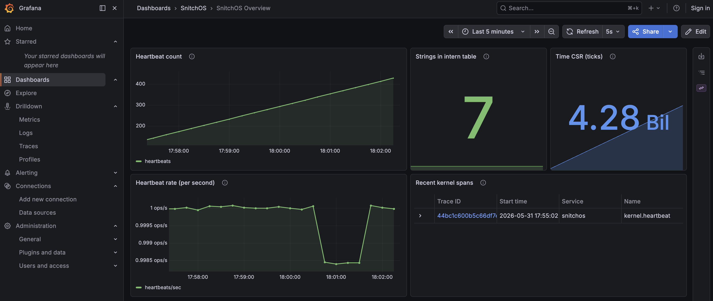

# snitchos

The operating system that snitches on itself 🐀



## Status

**v0.1 "Hello, traced world"** — *complete*. Kernel boots on RISC-V in QEMU, emits a structured boot-phase span tree over a dedicated virtio-console channel, host-side collector decodes and prints.

**v0.2 "Grafana arrives"** — *complete*. Tempo + Prometheus + Grafana stack via docker-compose; collector exports OTLP traces + serves Prometheus `/metrics`; provisioned dashboard shows live kernel telemetry.

**v0.3 "Interrupts & clock"** — *complete*. Full S-mode trap handling (entry/exit asm + Rust dispatcher); SSTC-based timer interrupts; heartbeat is timer-driven (`wfi` between ticks) instead of busy-spin. First histogram metric (`snitchos.irq.timer.duration_ticks`) end-to-end through the collector's bucket accumulation into Grafana.

**v0.3.1 "Making the kernel testable"** — *complete*. Carved out `kernel-core` (host-buildable `no_std` library) holding the intern table, span registry, pre-init buffer, scause decoding, and the `FrameSink`/`Clock` traits. 29 host unit tests over the data logic. New `xtask test` harness boots the kernel in QEMU, decodes the virtio-console telemetry stream, asserts on the `Frame` sequence — 3 scenarios passing in ~5s wallclock. See [posts/post-8-making-the-kernel-testable.md](posts/post-8-making-the-kernel-testable.md).

**v0.4 steps 1–3** — *complete*. Sv39 paging on, dual-mapped boot table, kernel relinked at higher-half VAs with PC trampoline + identity unmap, `va_to_pa` at every device-DMA site so virtio still works. 1 GiB Sv39 huge-page leaf installs a linear map of all physical RAM at `0xffffffd0_00000000+` so any allocated frame has a kernel-reachable VA via `pa_to_kernel_va`. Bitmap-based frame allocator in `kernel_core::frame` with O(1) free-count + short-circuit; kernel-side `frame::{alloc, alloc_zeroed, free, stats}` API; DTB-driven init reserving SBI / kernel image / DTB regions. Five new metrics (`snitchos.frames.*`) drive five new Grafana panels including a steady-state allocations-vs-frees view and an OOM curve when the `oom-leak` feature is on. See [posts/post-9-moving-the-kernel-without-breaking-it.md](posts/post-9-moving-the-kernel-without-breaking-it.md) and [posts/post-10-frame-by-frame.md](posts/post-10-frame-by-frame.md).

Working:

- no_std kernel; handwritten boot stub + linker script; ns16550a UART driver
- DTB parse (memory, UART, timebase)
- virtio-console driver: discovery + modern-spec handshake + virtqueue + TX
- S-mode trap handler: register save/restore asm, Rust dispatcher with typed `scause` decoding, `stvec` install at boot
- SSTC timer: arm via `stimecmp` CSR; per-source + global interrupt enable; deferred-work pattern (IRQ stays tiny, main thread does heartbeat)
- `Clock` trait + `SstcClock` impl (abstraction surface for future SBI / non-RISC-V impls)
- `protocol` crate: postcard-encoded `Frame` enum (`Hello`, `SpanStart/End`, `Event`, `Metric`, `MetricRegister`, `StringRegister`, `Dropped`) with `MetricKind` (`Counter`/`Gauge`/`Histogram`), hosted TDD
- `tracing` module: timestamps from the `time` CSR, string intern table with metric-type registration, RAII-guarded spans via the `span!` macro, pre-init buffering with a `Dropped { count }` checkpoint after flush
- `kernel-core` library (host-buildable `no_std`): intern table, span registry, pre-init buffer, scause decoder, `FrameSink` + `Clock` traits — 29 host unit tests cover the data logic
- kernel-side metric helpers: `register_counter` / `register_gauge` / `register_histogram` / `emit_metric`
- `kernel.boot` opens at boot with `console_init` + `telemetry_init` sub-spans; `kernel.heartbeat` span + metric set emitted once per timer tick
- `collector` (host-side): decodes the wire stream, reassembles spans, exports OTLP/HTTP to Tempo, serves Prometheus text on `/metrics` with full counter/gauge/histogram bucketing
- docker-compose stack: Tempo + Prometheus + Grafana, all auto-provisioned (datasources + dashboard with timer-IRQ percentile panel)
- `xtask` orchestration: `cargo xtask up` (kernel) / `cargo xtask collect` (collector) / `cargo xtask stack {up,down,logs}` / `cargo xtask test` (kernel integration scenarios in QEMU)
- Sv39 page tables, higher-half kernel, identity unmap, linear map at `0xffffffd0_00000000` so all physical RAM is reachable via `pa_to_kernel_va`
- physical frame allocator (4 KiB pages, bitmap-tracked) with `frame::{alloc, alloc_zeroed, free, stats}`; DTB-driven init; per-frame metrics on the wire and in Grafana

Up next: **v0.4 step 4 (kernel heap)** — `GlobalAlloc` impl on top of `frame::alloc`, so `Box` / `Vec` / `String` / `BTreeMap` start working inside the kernel. Then v0.5 (threading + round-robin scheduler).

See [posts/](posts/) for the per-milestone devlog.

## Quick start

Three terminals:

```
# Once per session: bring up the observability stack.
cargo xtask stack up
# (Grafana → http://localhost:3000 — anonymous admin)

# Terminal A — kernel + QEMU. Blocks at the telemetry chardev until
# the collector connects in terminal B.
cargo xtask up

# Terminal B — collector. Decodes frames, posts OTLP to Tempo,
# serves Prometheus /metrics on :9091.
cargo xtask collect
```

Then open Grafana → Dashboards → SnitchOS → SnitchOS Overview.

Quit QEMU with `Ctrl-A x`. `cargo xtask stack down` shuts the stack.

For ad-hoc debug without the stack:

```
cargo xtask reader              # text-only frame dump, no docker
cargo xtask reader -- --pretty  # multi-line debug format
```

## Subcommands

```
cargo xtask build              # build the kernel ELF
cargo xtask up                 # build kernel + run in QEMU
cargo xtask collect            # build + run collector (OTLP + Prometheus)
cargo xtask collect -- --text  # also print decoded frames to stdout
cargo xtask reader             # collector in text-only mode (no docker needed)
cargo xtask stack up           # docker-compose up the stack
cargo xtask stack down         # docker-compose down
cargo xtask stack logs         # tail container logs
cargo xtask test               # run all kernel integration tests in QEMU
cargo xtask test <scenario>    # run one scenario by name
cargo xtask --help
```

## Kernel integration tests

`cargo xtask test` boots the kernel in QEMU, reads the virtio-console
telemetry stream, decodes `Frame`s, and asserts on the sequence.
Requires `qemu-system-riscv64` on `PATH` (skips cleanly with exit 0 if
missing).

Scenarios:

- **`boot-reaches-heartbeat`** — Hello frame first on wire → `kernel.boot`
  SpanStart → `Dropped(0)` checkpoint after pre-init flush → first
  `kernel.heartbeat` SpanStart. Proves boot order and that the timer
  IRQ is actually firing.
- **`heartbeat-cadence`** — two consecutive `kernel.heartbeat` spans
  arrive with monotonically-increasing timestamps. Proves the IRQ keeps
  firing across multiple ticks.
- **`pre-init-order`** — first `StringRegister` on the wire is for
  `kernel.boot`, and every observed `SpanStart`'s `name_id` was
  registered earlier in the stream. Proves the pre-init buffer drains
  in order.
- **`kernel-runs-at-higher-half`** — kernel reads its own PC via
  `auipc` post-trampoline and only emits a `kernel.runs_at_higher_half`
  span if PC ≥ `KERNEL_OFFSET`. Catches a silently-no-op trampoline.
- **`frame-allocator-metrics`** — `snitchos.frames.allocated_total`
  reaches ≥1 within 10 s. Proves the frame allocator init ran and
  the linear map resolves (alloc_zeroed writes 4 KiB through
  `pa_to_kernel_va`).
- **`frame-allocator-oom`** — built with the `oom-leak` cargo feature
  so the heartbeat smoke leaks 8192 frames/tick. Asserts
  `snitchos.frames.alloc_failed_total > 0` within 15 s (the pool
  exhausts in ~4 heartbeats) and that two more heartbeats arrive
  post-OOM, proving the kernel survives memory exhaustion cleanly.

Each scenario spawns its own QEMU process and per-pid socket
(`/tmp/snitch-itest-<scenario>-<pid>.sock`); the harness always kills
QEMU and removes the socket on drop, so a panicking test cleans up.

A full `cargo xtask test` takes ~12 seconds wallclock (one feature-flag
rebuild between the default-feature scenarios and the OOM scenario).

## Reading

- [docs/README.md](docs/README.md) — design overview (the three pillars: observability, capabilities, microkernel).
- [docs/v0.1-hello-traced-world.md](docs/v0.1-hello-traced-world.md) — v0.1 milestone plan.
- [plans/v0.2-grafana.md](plans/v0.2-grafana.md) — v0.2 implementation plan.
- [plans/virtio-console.md](plans/virtio-console.md) — virtio-console implementation plan.
- [plans/v0.3-interrupts.md](plans/v0.3-interrupts.md) — v0.3 implementation plan.
- [plans/kernel-core-carveout.md](plans/kernel-core-carveout.md) — the host-testability extraction plan + as-built notes.
- [plans/kernel-integration-tests.md](plans/kernel-integration-tests.md) — the QEMU-driven scenario harness.
- [plans/v0.4-memory-concepts.md](plans/v0.4-memory-concepts.md) — Sv39, higher-half, frame allocator concepts before code.
- [plans/v0.4-memory-step-1-satp-on.md](plans/v0.4-memory-step-1-satp-on.md) — Sv39 identity boot table + first `csrw satp`.
- [plans/v0.4-memory-step-3-frame-allocator-concepts.md](plans/v0.4-memory-step-3-frame-allocator-concepts.md) — bitmap vs linked-list vs buddy; the linear-map design call.
- [plans/v0.4-memory-step-3-frame-allocator.md](plans/v0.4-memory-step-3-frame-allocator.md) — frame allocator implementation plan.
- [plans/v0.4-memory-findings.md](plans/v0.4-memory-findings.md) — what we learned (and what we worked around) building higher-half.
- [plans/scaling-corners.md](plans/scaling-corners.md) — known corners for SMP / interrupts.
- [posts/](posts/) — devlog notes as we go.

## Workspace layout

```
kernel/         no_std RISC-V S-mode kernel; entry.S, linker.ld, drivers
kernel-core/    host-buildable no_std lib: pure data + bookkeeping, unit-tested
protocol/       postcard-encoded telemetry Frame enum (no_std); std-gated stream decoder
collector/      host-side: decode frames; export OTLP; serve /metrics
xtask/          orchestration commands (this file's "Quick start")
stack/          docker-compose: Tempo + Prometheus + Grafana + provisioning
docs/           project design + milestone plans
plans/          in-progress implementation plans
posts/          devlog notes
```

## QEMU controls

- `Ctrl-A x` — quit QEMU.
- `Ctrl-A c` — toggle to QEMU's monitor (debug shell). Same combo again to return.
- `Ctrl-A h` — help.

## Useful one-offs

Dump the QEMU `virt` machine's device tree (binary → readable):

```
qemu-system-riscv64 -machine virt -machine dumpdtb=virt.dtb
brew install dtc           # one-time
dtc -I dtb -O dts virt.dtb -o virt.dts
```

Inspect the kernel ELF's section layout:

```
cargo objdump -p kernel --target riscv64gc-unknown-none-elf -- -h
```

(needs `rustup component add llvm-tools-preview` and `cargo install cargo-binutils`)

Check what Prometheus is scraping:

```
curl -s http://localhost:9091/metrics
```
