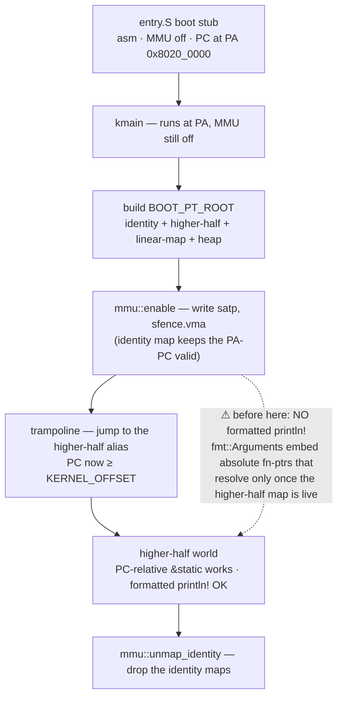

<!-- diagram: reviewed 2026-07-05, owner=boot-handoff. Hand-drawn (bucket A) —
     update when the boot / trampoline order moves. Not generated/gated. -->

# Boot → higher-half handoff

The kernel image is *linked* at higher-half VAs (`0xffffffff_80200000+`) but the
CPU starts executing it at its *physical* address with the MMU off. Boot's job is
to build the page tables, turn on the MMU, and jump the PC from PA into the
higher-half alias — without stepping on the one hazard that bites everyone: no
formatted `println!` may run before the higher-half mapping is live.

## Why each step is where it is

- **Identity map at `mmu::enable`.** The instant `satp` is written the PC is
  *still* the physical address, so the page tables must identity-map that PA or
  the very next fetch faults. The identity map is scaffolding — it keeps the
  PA-PC valid just long enough to reach the trampoline.
- **The trampoline jump.** `mmu::enable` doesn't move the PC; the trampoline
  does — an explicit jump to the higher-half alias of the next instruction, after
  which `auipc`/PC-relative addressing resolves into higher-half VAs naturally
  (integration test `kernel-runs-at-higher-half`).
- **`unmap_identity` runs later.** Once nothing depends on the identity map it's
  torn down, leaving only the intended higher-half / linear / heap windows (see
  [memory-map.md](memory-map.md)).

## The `println!` cliff

`fmt::Arguments` (every formatted `println!`) embeds absolute fn-pointer values
to type-specific formatters. Those resolve only after the higher-half mapping is
live, so a formatted `println!` before `mmu::enable` crashes. Raw
character/string output over the NS16550A UART is fine pre-MMU; formatted output
is not.

## Other pre-MMU landmines

- Walking the DTB pre-MMU under the higher-half link crashes silently (never
  isolated). MMIO regions in `kmain` are therefore **hardcoded for QEMU `virt`**;
  the DTB-driven `collect_mmio_regions` exists but is parked behind
  `#[expect(dead_code)]`.

Read `../plans/v0.4-memory-findings.md` before disturbing the boot order.
