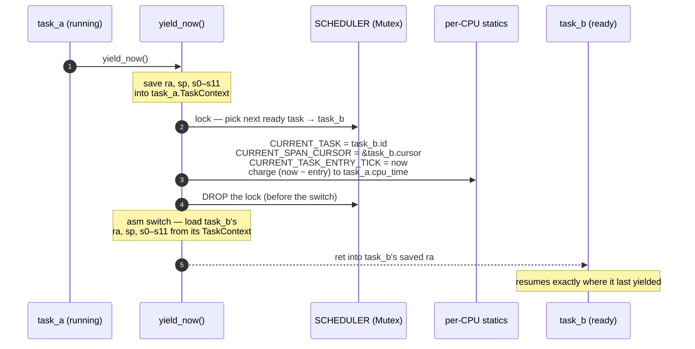

<!-- diagram: reviewed 2026-07-05, owner=context-switch. Hand-drawn (bucket A) —
     update when the yield_now / SpanCursor flow moves. Not generated/gated. -->

# A cooperative context switch

The v0.5 scheduler has no dedicated scheduler thread — `yield_now()` runs *on the
calling task's own stack*, saves its callee-saved registers into its
`TaskContext`, picks the next ready task, loads that task's registers, and `ret`s
into it. The subtle part is the telemetry state that has to move in lock-step so
a span opened by `task_a` still attributes correctly after the switch.

## Invariants that make this safe

- **Tasks live in `Box<Task>`.** The scheduler mutex is dropped *before* the asm
  switch, but the raw `*mut TaskContext` / `*const SpanCursor` pointers stay
  valid because the heap addresses are stable — the `Box` guarantees it.
- **Never hold a `kernel::sync::Mutex` across `yield_now()`.** Cooperative, not
  enforced (a debug "held locks at yield" assert is a candidate). Holding one
  deadlocks the next task that wants it.
- **`CURRENT_SPAN_CURSOR` swaps on every switch.** `tracing::span_start` reads it
  for the parent; a `Span` guard remembers *which* cursor it opened on, so a span
  held open across a yield (task_a does this deliberately) closes on the right
  cursor even after the detour. That's the `sched-span-survives-yield` proof:
  `SpanStart → ContextSwitch(leave) → ContextSwitch(return) → SpanEnd`, same span
  id, `parent == SpanId(0)`.

## The four boot tasks

| Task | What it is |
|---|---|
| **main** (task 0) | *is* `kmain` — `register_bare_task("main")` declares the running boot context as task 0; the `entry.S` boot stack is its stack |
| **idle** | `loop { wfi; yield_now(); }` — owns the only `wfi` in the kernel |
| **task_a / task_b** | demo workers; task_a holds a `task_a.tick` span open across a yield to exercise `SpanCursor` correctness |

See `../plans/v0.5-threading.md` for the design and
`../posts/post-12-the-kernel-takes-turns.md` for the devlog.
