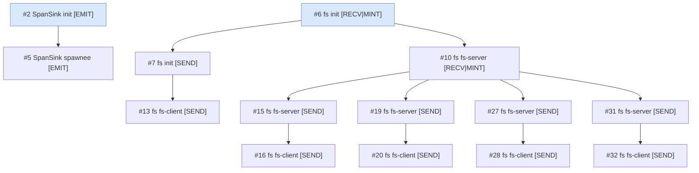

<!-- generated by: cargo xtask diagram caps — do not edit -->

# Capability derivation tree

*From a live boot. Each node is a capability — `#id object holder [rights]`, holder resolved to its process name; edges show `parent → derived`. Blue = a root grant (`parent_cap_id 0`); `⊘ revoked` marks a revoked cap. One-shot reply caps and isolated bootstrap grants (per-process telemetry/span sinks) are omitted so the delegation structure stands out.*

