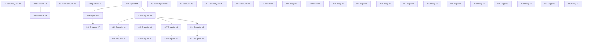

<!-- generated by: cargo xtask diagram caps — do not edit -->

# Capability derivation tree

```mermaid
graph TD
    cap1["#1 TelemetrySink h4"]
    cap2["#2 SpanSink h4"]
    cap3["#3 TelemetrySink h5"]
    cap4["#4 SpanSink h5"]
    cap5["#5 SpanSink h5"]
    cap6["#6 Endpoint h4"]
    cap7["#7 Endpoint h4"]
    cap8["#8 TelemetrySink h6"]
    cap9["#9 SpanSink h6"]
    cap10["#10 Endpoint h6"]
    cap11["#11 TelemetrySink h7"]
    cap12["#12 SpanSink h7"]
    cap13["#13 Endpoint h7"]
    cap14["#14 Reply h6"]
    cap15["#15 Endpoint h6"]
    cap16["#16 Endpoint h7"]
    cap17["#17 Reply h6"]
    cap18["#18 Reply h6"]
    cap19["#19 Endpoint h6"]
    cap20["#20 Endpoint h7"]
    cap21["#21 Reply h6"]
    cap22["#22 Reply h6"]
    cap23["#23 Reply h6"]
    cap24["#24 Reply h6"]
    cap25["#25 Reply h6"]
    cap26["#26 Reply h6"]
    cap27["#27 Endpoint h6"]
    cap28["#28 Endpoint h7"]
    cap29["#29 Reply h6"]
    cap30["#30 Reply h6"]
    cap31["#31 Endpoint h6"]
    cap32["#32 Endpoint h7"]
    cap33["#33 Reply h6"]
    cap34["#34 Reply h6"]
    cap35["#35 Reply h6"]
    cap2 --> cap5
    cap6 --> cap7
    cap6 --> cap10
    cap7 --> cap13
    cap10 --> cap15
    cap15 --> cap16
    cap10 --> cap19
    cap19 --> cap20
    cap10 --> cap27
    cap27 --> cap28
    cap10 --> cap31
    cap31 --> cap32
```
