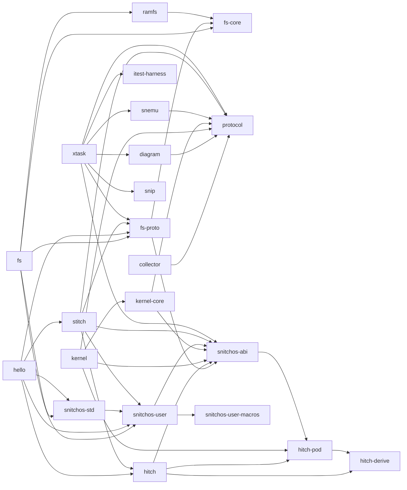

<!-- generated by: cargo xtask diagram deps — do not edit -->

# Workspace crate graph

```mermaid
graph LR
    collector["collector"]
    diagram["diagram"]
    fs["fs"]
    fs_core["fs-core"]
    fs_proto["fs-proto"]
    hello["hello"]
    hitch["hitch"]
    hitch_derive["hitch-derive"]
    hitch_pod["hitch-pod"]
    itest_harness["itest-harness"]
    kernel["kernel"]
    kernel_core["kernel-core"]
    protocol["protocol"]
    ramfs["ramfs"]
    snemu["snemu"]
    snip["snip"]
    snitchos_abi["snitchos-abi"]
    snitchos_std["snitchos-std"]
    snitchos_user["snitchos-user"]
    snitchos_user_macros["snitchos-user-macros"]
    stitch["stitch"]
    xtask["xtask"]
    collector --> protocol
    diagram --> protocol
    fs --> fs_core
    fs --> fs_proto
    fs --> ramfs
    fs --> snitchos_std
    fs --> snitchos_user
    fs_proto --> fs_core
    fs_proto --> snitchos_abi
    hello --> fs_proto
    hello --> hitch
    hello --> snitchos_std
    hello --> snitchos_user
    hello --> stitch
    hitch --> hitch_derive
    hitch --> hitch_pod
    hitch --> snitchos_abi
    hitch_pod --> hitch_derive
    kernel --> hitch_pod
    kernel --> kernel_core
    kernel --> protocol
    kernel --> snitchos_abi
    kernel_core --> protocol
    kernel_core --> snitchos_abi
    ramfs --> fs_core
    snemu --> protocol
    snitchos_abi --> hitch_pod
    snitchos_std --> snitchos_user
    snitchos_user --> snitchos_abi
    snitchos_user --> snitchos_user_macros
    stitch --> hitch
    stitch --> protocol
    stitch --> snitchos_abi
    stitch --> fs_proto
    stitch --> snitchos_user
    xtask --> diagram
    xtask --> fs_proto
    xtask --> itest_harness
    xtask --> protocol
    xtask --> snemu
    xtask --> snip
    xtask --> snitchos_abi
```
