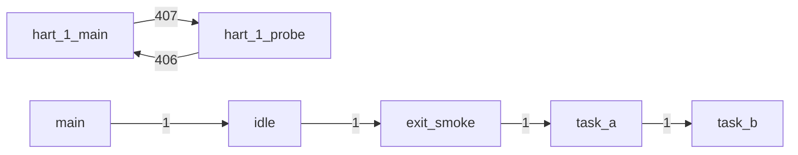

<!-- generated by: cargo xtask diagram switches — do not edit -->

# Scheduler task-transition graph

```mermaid
graph LR
    t7["hart_1_main"]
    t8["hart_1_probe"]
    t0["main"]
    t1["idle"]
    t2["exit_smoke"]
    t3["task_a"]
    t4["task_b"]
    t7 -->|407| t8
    t8 -->|406| t7
    t0 -->|1| t1
    t1 -->|1| t2
    t2 -->|1| t3
    t3 -->|1| t4
```
