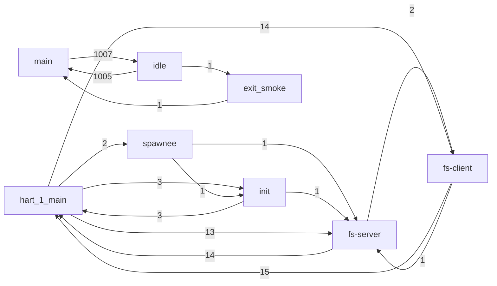

<!-- generated by: cargo xtask diagram switches — do not edit -->

# Scheduler task-transition graph

*From a live boot. Nodes are tasks (named via `ThreadRegister`); an edge `a → b` labelled `N` means the scheduler switched from `a` to `b` `N` times. Disconnected clusters are separate harts.*

