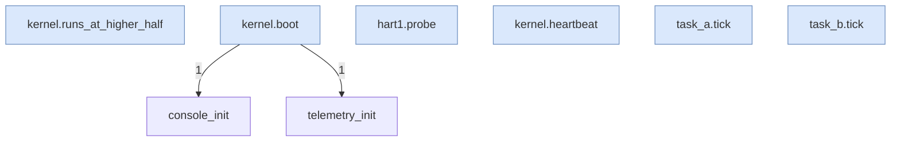

<!-- generated by: cargo xtask diagram trace — do not edit -->

# Span call-graph

```mermaid
graph TD
    kernel_runs_at_higher_half["kernel.runs_at_higher_half"]
    kernel_boot["kernel.boot"]
    console_init["console_init"]
    telemetry_init["telemetry_init"]
    hart1_probe["hart1.probe"]
    kernel_heartbeat["kernel.heartbeat"]
    task_a_tick["task_a.tick"]
    task_b_tick["task_b.tick"]
    kernel_boot -->|1| console_init
    kernel_boot -->|1| telemetry_init
    classDef root fill:#dae8fc,stroke:#6c8ebf;
    class kernel_runs_at_higher_half,kernel_boot,hart1_probe,kernel_heartbeat,task_a_tick,task_b_tick root;
```
