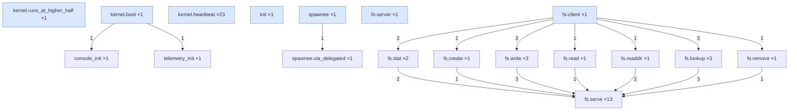

<!-- generated by: cargo xtask diagram trace — do not edit -->

# Span call-graph

*From a live boot, collapsed by span name. `name ×N` = how many times that span opened; an edge `parent → child` labelled `N` is that nesting's count. Blue = a top-level span (`parent SpanId(0)`) — most SnitchOS spans are top-level, so this is more a span-frequency profile than a deep tree.*

