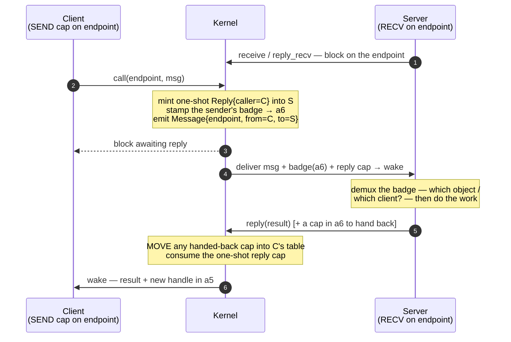

<!-- diagram: reviewed 2026-07-05, owner=ipc-call-reply. Hand-drawn (bucket A) —
     update when the call/reply/reply_recv path moves. Not generated/gated. -->

# IPC: a synchronous call / reply

SnitchOS IPC is a synchronous rendezvous over an `Endpoint` cap — no queue. A
client `call`s; the kernel delivers the message to a server blocked in
`receive`/`reply_recv`, mints a **one-shot reply cap** into the server so it can
answer *exactly once*, and blocks the client until it does.

## Why the shape

- **The reply cap *is* the authority.** It's the one-shot `Object::Reply{caller}`
  the kernel mints into the server; `reply`/`reply_recv` are authorized purely by
  holding it. It's minted with `parent_cap_id == 0` — which is exactly why reply
  caps are the unparented leaves filtered out of the
  [capability derivation tree](generated/caps.md).
- **Badge in `a6` (in), handle in `a5` (out).** The kernel stamps the badge from
  the cap the *sender* used; the server demuxes against its own table (`a6 = 0`
  for a bare cap). On the way back, a `reply` may carry one cap in `a6` — the
  kernel **moves** it out of the server's table into the caller's, and the
  caller's `call` returns the fresh handle in `a5`. This reply-path cap-transfer
  is load-bearing for the FS: `lookup`/`open` is a `call` whose reply hands back
  a freshly-minted, badged child cap.
- **`reply_recv` fuses reply + receive** — the server's steady-state loop: answer
  the current caller, then block receiving the next message in one syscall.
- **Borrow, then consume.** For bulk transfer (FS `read`/`write`), the server may
  `copy_across` many times — each *borrows* the reply cap — before the final
  `reply` *consumes* it.

See [ipc-design.md](ipc-design.md) for the full design and
`../plans/legacy/v0.10-ramfs.md` for the bulk-copy path.
