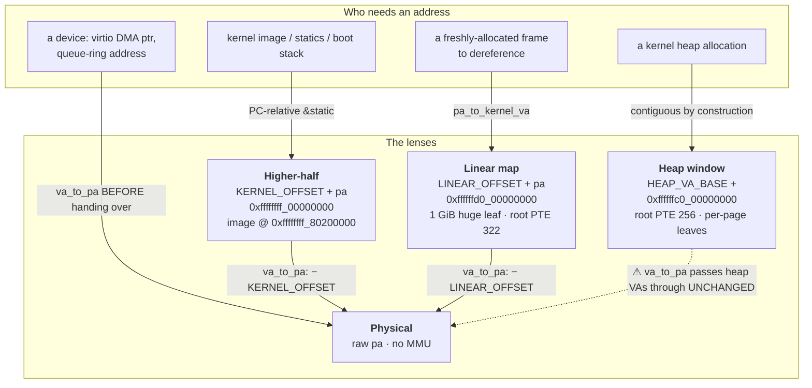

<!-- diagram: reviewed 2026-07-05, owner=memory-map. Hand-drawn (bucket A) —
     update when the address-space layout moves. Not generated/gated. -->

# The four address spaces

Post-trampoline, SnitchOS runs at higher-half PC with three distinct *virtual*
lenses onto physical RAM plus the raw physical addresses devices see. Which lens
to use depends entirely on the consumer — getting it wrong DMAs the wrong
physical memory or faults. This is the single most re-explained thing in the
kernel; read it before touching any translation site.

| Lens | VA | Root PTE | Used for | → PA via |
|---|---|---|---|---|
| **Higher-half** | `KERNEL_OFFSET + pa` (`0xffffffff_00000000`); image linked at `0xffffffff_80200000` | ~510 | kernel image, statics, boot stack | `va_to_pa` (subtract `KERNEL_OFFSET`) |
| **Linear map** | `LINEAR_OFFSET + pa` (`0xffffffd0_00000000`) | 322 (the leaf covering RAM @ `0x8000_0000`) | dereferencing any allocated frame; the page-table walker reads/writes intermediate tables through this lens | `pa_to_kernel_va` / subtract `LINEAR_OFFSET` |
| **Heap window** | `HEAP_VA_BASE +` (`0xffffffc0_00000000`) | 256 (+ 257 = per-task stack guard-page window) | the `#[global_allocator]` heap; VAs contiguous, PA frames scattered | ⚠ **not** handled by `va_to_pa` — stage through `TX_STAGING` before DMA |
| **Physical** | raw `pa` | — | anything handed to a device: virtio DMA buffers, queue-ring addresses in `REG_QUEUE_DESC_LOW/HIGH` | identity — devices have no MMU |

## Why the heap-window ⚠ matters

`mmu::va_to_pa()` only translates `KERNEL_OFFSET`-range VAs; a heap VA
(`HEAP_VA_BASE+`) is passed through **unchanged**. So a heap-allocated buffer
handed straight to virtio would carry a heap VA where the device expects a PA,
silently DMA-ing wrong physical memory. That's why `virtio_console::send` stages
frame bytes through the static `TX_STAGING` buffer (a higher-half static, whose
VA `va_to_pa` *does* handle) rather than DMA-ing task stacks directly. Caught in
v0.5 step 7.

## Gotchas

- Anything passing a kernel address to a device must go through `va_to_pa` —
  there are four such sites in `virtio_console.rs`; grep before adding a fifth.
- Anything needing the *physical* address of a kernel symbol must do
  `va_to_pa((&raw const __sym) as usize)` — post-trampoline that operand is a
  higher-half VA.
- No formatted `println!` before `mmu::enable` — see
  [boot-handoff.md](boot-handoff.md) / `../plans/v0.4-memory-findings.md`.

Read `../plans/v0.4-memory-findings.md` **before** disturbing the boot order or
any address-translation site.
