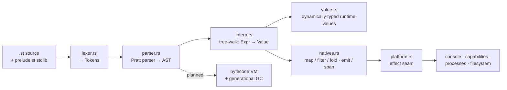

<!-- diagram: reviewed 2026-07-05, owner=stitch-pipeline. Hand-drawn (bucket A) —
     update when the interpreter pipeline moves. Not generated/gated. -->

# The Stitch interpreter pipeline

Stitch (`.st`) is a Java-shaped managed language for SnitchOS. v0 is a
tree-walker: **the AST *is* the program — no compilation**. Source flows through
a lexer and a Pratt parser into an AST that the interpreter walks directly,
reaching the outside world only through a deliberately narrow effect seam.

## The stages

- **`lexer.rs`** — source text → `Token`s.
- **`parser.rs`** — a Pratt parser over the precedence table → AST. (Note the
  maximal-munch gotcha: a call followed by `(` calls its *result*.)
- **`interp.rs`** — recursively evaluates an `Expr` to a `Value`. No bytecode, no
  compile step; the tree is walked as-is.
- **`value.rs`** — runtime values, **dynamically typed**: a `Value` carries its
  own kind and operations check kinds at runtime (no implicit Int/Float
  coercion — a preview of the eventual static types).
- **`natives.rs`** — the built-ins that can't be written in Stitch itself: the
  combinators (`map`/`filter`/`fold`/`join`) and host I/O (`emit`/`span`). The
  rest of the stdlib *is* Stitch — see `prelude.st`. (Stitch has **no loop
  keywords**; iteration is recursion + combinators.)
- **`platform.rs`** — the effect seam: *what actually happens* when a program
  touches console / capabilities / processes / the filesystem, decoupled from
  the natives that trigger it. Swapping this backing is what lets the same
  interpreter run on the host *and* on-target over SnitchOS syscalls.

See [language-design.md](language-design.md) and the `../plans/lang/` track.
