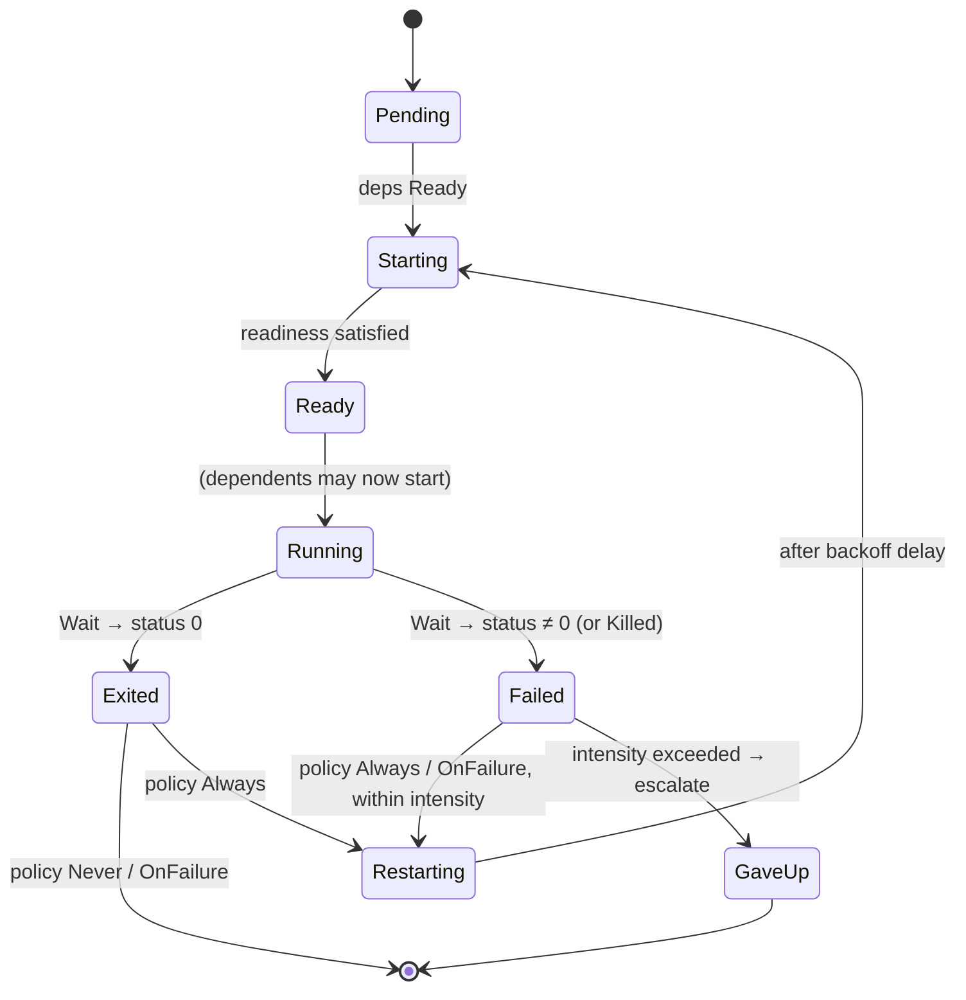

# 🌳 Supervision-tree design

*Supervision is capability ownership viewed twice. The supervisor owns the durable objects; services borrow authority from it and are restartable precisely because of that. Every transition is a span.*

**Status: design only — not built.** This is redesign item **#6** from
[redesign-from-scratch.md](redesign-from-scratch.md). It builds on shipped
primitives (`Spawn`, `Wait`/`WaitAny`, `EndpointCreate`, `Notify`, caps + `Revoke`,
the clock) and names two new ones it would need for the *full* vision. Nothing
here is implemented; the increment plan at the end is the build order.

Related: [capability-system-design.md](capability-system-design.md),
[ipc-design.md](ipc-design.md), [notification-design.md](notification-design.md),
[observability-design.md](observability-design.md), and the actor-model reframe in
[userland-text-streams-and-the-actor-model-design.md](userland-text-streams-and-the-actor-model-design.md).

---

## The problem: supervision is ad-hoc today

"Supervision" in SnitchOS today is one-off loops hardcoded into bespoke programs:

- `init` (`user/hello/src/bin/init.rs`) `EndpointCreate`s an endpoint, `Spawn`s the
  FS server + a client, and `WaitAny`s forever.
- `reaper` (`workload=spawn-reap`) spawns + `Wait`s a `memhog` child 30× in a loop.
- `supervisor` (`workload=wait-any`) spawns a `spinner` + a `spawnee`, `WaitAny`s
  once, emits the reaped id + status.

Each encodes *what runs, in what order, and what to do when it dies* as **code**.
There is no notion of a service, no dependency ordering, no restart policy, no
health, no shutdown. #6 makes that knowledge **data** and `init` a generic
**engine** over it.

## Core principle: supervision = capability ownership, viewed twice

This is the insight that makes SnitchOS's supervision more than a systemd clone,
and it turns a current wart into the mechanism.

When a service dies and restarts, the new instance is a **fresh process with a
fresh `CapTable`**. Two problems follow: the new instance needs its authority
back, and clients holding caps to the *old* instance must not be orphaned. The
clean answer is an invariant:

> **The supervisor owns the durable objects; services borrow authority from it for
> the lifetime of one incarnation.**

Concretely — today `init` `EndpointCreate`s the FS endpoint and delegates
`RECV | MINT` to the server, and [the v0.13 notes](redesign-from-scratch.md) flag
that init "over-holds `RECV`" as a wart. Under supervision that over-hold becomes
**the feature**: because *init* owns the endpoint object, when the FS server
crashes, init re-spawns it and re-delegates `RECV` to the new instance — and every
client's minted `SEND` cap still names the **same endpoint object**, so clients
survive the restart transparently. Services are restartable *because* their
authority is granted by the supervisor and outlives them. Capability ownership and
supervision are the same tree.

This also composes: a supervisor can supervise sub-supervisors (each owning its
subtree's durable objects), giving the recursive supervision tree. v1 is a single
level under `init`; the recursion is the general form.

---

## Three decisions this design pins

Everything else follows from these. Recommended choices, with rationale.

### D1 — Restart strategy set: one-for-one + rest-for-one (defer one-for-all)

The Erlang taxonomy for "a child died, what do we restart":

- **one-for-one** — restart just the dead child. The default; correct when services
  are independent.
- **rest-for-one** — restart the dead child *and everything started after it* (its
  dependents in start order). Correct when a downstream service can't survive its
  upstream restarting (it re-delegated caps, re-opened connections).
- **one-for-all** — restart the whole group on any death. Rarely needed once caps
  make dependencies explicit; **deferred**.

**Choice:** ship one-for-one + rest-for-one. rest-for-one falls out of the
dependency order we already compute, and it's exactly what the cap-re-grant story
needs (a dependent that cached a delegated handle to the old incarnation must
restart to pick up the new one). one-for-all adds a strategy without a motivating
case yet.

### D2 — Readiness: "spawned" by default, opt-in "signaled-ready"

A dependent must not start until its dependency is *usable*, not merely *spawned*.
Two tiers:

- **spawned** (default) — the dependency is considered ready the instant `Spawn`
  returns a task id. Fine for services with no startup work.
- **signaled-ready** (opt-in) — the service does startup work, then `Signal`s a
  readiness [notification](notification-design.md) the supervisor holds the `WAIT`
  end of. The supervisor blocks on it before starting dependents. This is
  systemd's `Type=notify`, and SnitchOS already has the exact primitive
  (`NotifyCreate`/`Signal`/`WaitNotify`, v0.12).

**Choice:** support both; `spawned` is the default, `signaled-ready` is a per-service
opt-in flag that names a readiness notification the supervisor creates and delegates
the `SIGNAL` end of. No new mechanism required.

### D3 — Cap re-grant model: supervisor-owns-endpoints (the invariant above)

Durable objects (endpoints, notifications, memory regions) are created **once** by
the supervisor and owned by it. A service receives *delegated handles* each
incarnation. On restart, the supervisor re-runs the same delegation against the new
`CapTable`. This is what makes D1's rest-for-one and D2's readiness coherent, and it
is the concrete resolution of the init over-hold wart.

Corollary: a service must **not** `EndpointCreate` an object other services depend
on — that object would die with it. Services may still create *private* objects
(their own scratch notifications). The supervisor owns everything that crosses a
service boundary.

---

## The service spec (the data model)

Pure data, host-testable, living in `kernel-core` alongside `sched::Runqueue` and
`bootargs` (the same "policy logic with no MMIO/CSRs" tier). Sketch:

```rust
struct ServiceSpec {
    name: &'static str,
    program: ProgramRef,          // Spawn registry id today; an FS path after #1
    grants: &'static [Grant],     // caps the supervisor delegates each incarnation
    deps: &'static [ServiceId],   // must be Ready before this one starts
    readiness: Readiness,         // Spawned | SignaledReady(NotifyId)
    restart: RestartPolicy,       // Never | OnFailure | Always
    limits: RestartLimits,        // intensity: max_restarts within window
}

enum ProgramRef { Registry(usize), /* File(Path) after #1 */ }
enum Readiness  { Spawned, SignaledReady }
enum RestartPolicy { Never, OnFailure, Always }
struct RestartLimits { max_restarts: u32, window: Duration }  // Duration ← the clock work
```

A `Grant` names a supervisor-owned object and the rights/handle-slot to delegate
into the child — the bridge to redesign **#2** (typed startup ABI): today it's a
positional `delegated_handle(i)`; after #2 it's "satisfy the child's declared
`Endpoint fs` requirement by role."

---

## Lifecycle state machine

Per service. The supervisor drives each service through this; the whole set is the
supervision tree.



`Exited` vs `Failed` is decided by the `i32` from `Wait`/`WaitAny`: **0 = clean,
non-zero = failure** (the honest exit-code plumbing from the #5 work — `process::exit(code)`
now carries the code, so `exit_with(134)` on abort is distinguishable). A future
supervisor-initiated `Kill` adds a third outcome.

## Dependency ordering

The `deps` edges form a DAG. Two pure functions in `kernel-core`:

```rust
fn startup_order(specs: &[ServiceSpec]) -> Result<Vec<ServiceId>, DependencyError>;
// topological sort; DependencyError::Cycle names the offending nodes.
// Teardown order is the reverse.

fn restart_set(strategy, failed: ServiceId, order: &[ServiceId]) -> Vec<ServiceId>;
// one-for-one → [failed]; rest-for-one → failed + everything after it in `order`.
```

Both are trivially unit-testable with no QEMU — the TDD sweet spot, same as the
scheduler's aging math.

## Restart policy, backoff, and intensity

The decision is a pure function of policy, exit outcome, and history:

```rust
fn restart_decision(
    policy: RestartPolicy,
    outcome: ExitOutcome,      // Clean | Failed(i32)  (later: Killed)
    history: &RestartHistory,  // recent restart timestamps
    limits: RestartLimits,
    now: Instant,
) -> RestartAction;

enum RestartAction { Restart { after: Duration }, Stop, Escalate }
```

- **Backoff:** exponential with a cap — `after = min(base · 2^consecutive_failures,
  cap)`. A clean-exit restart (policy `Always`) uses no/low backoff; a failure loop
  backs off.
- **Intensity (restart storm guard):** if restarts within `window` exceed
  `max_restarts`, return `Escalate` instead of looping. This is **not optional
  polish** — without it a crash-looping service is a busy-loop that floods the
  telemetry channel and starves everything else.
- **Escalation:** for `init` (the root) `Escalate` means log a fatal supervision
  event and halt (a crashed root service the system can't run without is a genuine
  panic). For a sub-supervisor it means the sub-supervisor itself `Exit`s failed,
  and *its* parent applies *its* policy — the recursion.

## Cap re-grant on restart (the mechanism)

On every `Starting` transition (first start or restart):

1. Supervisor has already created the service's durable objects **once** (at tree
   construction) and holds them.
2. `Spawn(program, handles)` where `handles` are the supervisor-table handles named
   by the spec's `grants` — copy-semantics delegation lands them at the child's
   `delegated_handle(0..)`.
3. On death + restart, step 2 re-runs against the **new** child table. Same objects,
   new incarnation. Clients holding minted caps to those objects are untouched.
4. `rest-for-one` restarts dependents so any that cached a delegated handle to the
   dead incarnation re-acquire the live one.

The old incarnation's private caps die with it (address space + table reclaimed on
`Exit` — the v0.12 reap path). No `Revoke` needed for those; `Revoke` is for
*proactively* reclaiming authority from a *live* misbehaving service (a policy hook,
not part of the restart happy path).

---

## Observability model — the payoff

This is the SnitchOS reason to build it. Every transition is already a wire event;
supervision makes the **structure** first-class.

- **Per-service umbrella span** covering *all* incarnations of a service, with each
  incarnation a **child span** under it. So Tempo shows "FS server, incarnation 3,
  restarted after a crash" correlated with incarnations 1–2 — restart continuity the
  raw `ThreadRegister`s (new task id per incarnation) can't express alone.
- **Metrics:** `snitchos.svc.<name>.restarts_total`, `.state` (an enum gauge),
  `.uptime_ticks`, `.backoff_ticks`. Per service, so a crash loop is a visible rising
  line before it trips intensity.
- **State-transition events:** each `Pending→Starting→Ready→…` edge is a span event
  or a `CapEvent`-style attributed frame, carrying the reason (exit status, backoff,
  escalation).
- **The tree itself:** nodes = services (colored by `state`), edges = `deps` +
  cap-delegation (already `CapEvent::Granted`/`Transferred` on the wire). A **live
  supervision tree in Grafana** is then just a query over existing frames.

The devlog money shot is the same shape as the v0.5 "follow a trace across a context
switch" post: **watch a service crash and get restarted, and the trace proves it** —
authority flowing down the tree, restarts nested under the service's umbrella span.

---

## Primitives: have vs missing

**v1 (crash-restart) is achievable on shipped primitives:**

| Need | Primitive | Status |
|---|---|---|
| Launch + delegate caps | `Spawn` (15), `SpawnImage` (26) | ✅ |
| Crash detection + status | `Wait` (18), `WaitAny` (24) → `i32` | ✅ |
| Supervisor-owned durable endpoints | `EndpointCreate` (25) | ✅ |
| Readiness / heartbeat | `NotifyCreate`/`Signal`/`WaitNotify` (21–23) | ✅ |
| Backoff timing | `ClockNow` (20) / `ClockFreq` (29) → `Duration` | ✅ (v#5) |
| Proactive authority reclaim | `Revoke` (28) | ✅ |
| Every transition observable | span + `CapEvent` + metric frames | ✅ |

**v2 (health + graceful shutdown) needs two new primitives:**

1. **Supervisor-initiated `Kill(child)`.** Today a process only `Exit`s *itself* —
   there is no way to terminate another. Needed to (a) shut a service down gracefully
   in reverse-dep order, and (b) restart a *hung* (alive-but-wedged) service. A
   capability-shaped kill (the supervisor holds a "lifecycle" cap over its children)
   fits the model.
2. **Timed wait / deadline.** `Wait`/`WaitAny` block indefinitely. Detecting
   "hung, not dead" needs `WaitAny`-with-deadline (or a readiness-heartbeat that
   times out). The clock work gives the *time source*; the *blocking-with-deadline*
   syscall is missing.

So the honest split: **v1 = crash-restart** (Wait-based, one-for-one + rest-for-one,
backoff + intensity, supervisor-owned endpoints, every transition a span) — fully
doable now. **v2 = health checks + graceful shutdown** — gated on `Kill` + timed wait.
Don't oversell v1 as full lifecycle management.

---

## Where the code lives + increment plan

Mirrors the project's kernel-core-vs-userspace split: **pure policy in `kernel-core`
(host-tested), mechanism in a userspace engine.**

1. **`kernel-core::supervision`** — `ServiceSpec`, `startup_order` (topo + cycle
   detection), `restart_decision` (policy + backoff + intensity), `restart_set`
   (D1). All pure, all `cargo test -p kernel-core`. TDD each.
2. **Generic supervisor engine** — evolve `init` (or a new `supervisor` root) into an
   engine that reads a service table, creates durable objects, brings services up in
   `startup_order` (respecting `readiness`), runs a `WaitAny` loop, and on each exit
   consults `restart_decision` → re-spawn + re-delegate (§ cap re-grant) or escalate.
3. **Supervision telemetry** — umbrella span per service, incarnation child spans,
   `restarts_total` + `state` metrics, transition events.
4. **Acceptance itest** (`workload=supervised-crash-loop`): a service that exits
   non-zero on a schedule; assert it restarts `N` times, that backoff spacing grows,
   that intensity trips `Escalate` after the cap, and that a **client's minted cap
   survives** across a restart (proves D3). Reuses the honest exit-code path from #5.
5. **v2 later** — `Kill` + timed wait, then graceful shutdown (reverse-dep teardown)
   and hung-service detection.

## Interaction with #1 and #2

- Wants **#2 (typed startup ABI)**: `Grant` becomes "satisfy the child's declared
  capability requirement by role," not a positional `delegated_handle(i)`. Cleaner,
  but v1 works on today's positional delegation.
- Benefits from **#1 (programs-as-files)**: `ProgramRef::File(path)` instead of a
  `Registry(id)`, so the service table is data all the way down and adding a service
  is not a kernel edit. v1 works on `Spawn`-by-registry-id.

Neither blocks v1. If #1/#2 are on the near roadmap, doing a slice of them first
makes #6 land straighter; if not, #6 stands alone on today's primitives.

## Open questions

- **Escalation at the root.** Is a root-service intensity breach always a system
  halt, or can `init` run in a degraded mode (some services down)? Leaning: halt for
  services marked `critical`, degrade for the rest — but that adds a `critical` flag.
- **Readiness timeout without v2's timed wait.** A `signaled-ready` service that
  never signals blocks bring-up forever in v1 (no deadline). Acceptable for v1
  (it's a boot-time bug, loudly stuck), but note it.
- **Dependency-failure semantics.** If a dependency hits `GaveUp`, do its dependents
  stop too? rest-for-one handles *restart*; permanent failure propagation is a
  separate policy (probably: dependents of a `GaveUp` service also stop). Decide
  when v1's escalation lands.
- **One durable-object registry or per-service?** Where exactly the supervisor tracks
  "which objects belong to which service" — a flat table vs nested — affects the
  recursive (sub-supervisor) case. Flat is fine for single-level v1.
