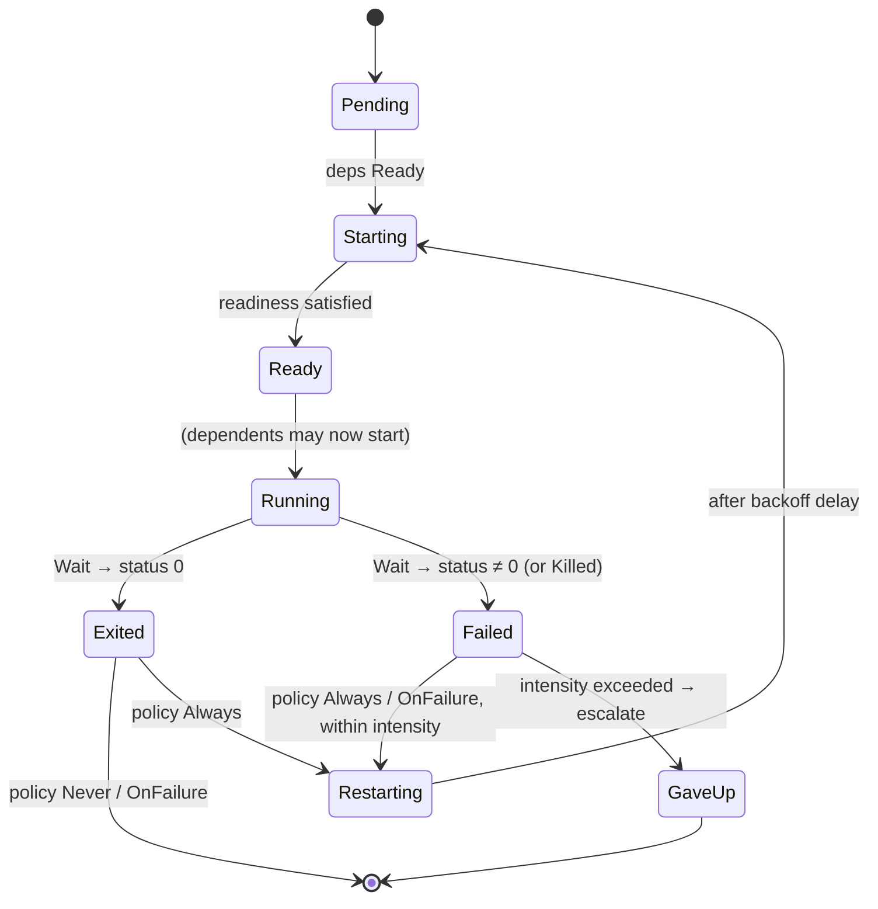

<!-- diagram: reviewed 2026-07-05, owner=supervision-lifecycle. Hand-drawn
     (bucket A) — update when the service lifecycle moves. Not generated/gated. -->

# Service lifecycle (supervision)

Per service. The supervisor (`init`) drives each service through this state
machine; the whole set of services and their `deps` edges *is* the supervision
tree. See [supervision-design.md](supervision-design.md) for the full design.

**`Exited` vs `Failed` is decided by the `i32` from `Wait`/`WaitAny`:** `0` =
clean, non-zero = failure (`process::exit(code)` carries the code, so
`exit_with(134)` on abort is distinguishable). Restart is governed by the
service's policy (`Never` / `OnFailure` / `Always`) and a restart-intensity
budget; exceeding it escalates to `GaveUp`. A future supervisor-initiated `Kill`
adds a third terminal outcome.
