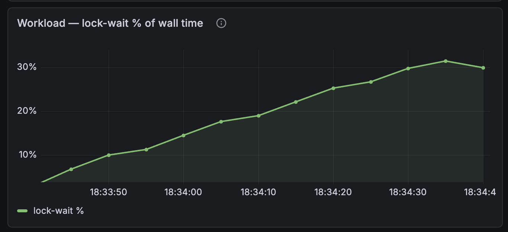

# Post 19 — Removing the lock made it slower

> The long-promised SMP payoff finally landed: producer on hart 0, consumer on hart 1, `Mutex<VecDeque>` between them — and a Grafana panel climbing to 30 % of wall time spent waiting on the lock. The chokepoint, visible at last. Then I did the obvious thing — swapped the Mutex for a lock-free `heapless::spsc` queue — and throughput *dropped*. Not "didn't improve." Dropped, ~30 %. Chasing why turned into the best result of the milestone: the lock was never the cost, *paying for cross-hart synchronization once per item* was. The Mutex amortized it over a 64-item batch by accident; naive lock-free paid it per item. A batched lock-free ring fixed it — and revealed the lock's real sin wasn't slowness, it was *variance*. None of this was visible until I made the workload swappable at runtime and built a one-command measurement harness, so I could A/B three queue designs without ever leaving `main`.

## what this post was supposed to be

Posts 16, 17, and 18 all ended the same way: *next time, the SMP payoff.* Consumer to hart 1, `Mutex<VecDeque>` under genuine cross-hart contention, the dashboard telling the story. Each time something more urgent jumped the queue — a fence that turned out to be a no-op, a suite that needed to run in parallel, a flake that had a fingerprint.

This is that post. It delivers the payoff. It also spends most of its length on what happened *after* the payoff, because the payoff was the boring part and the surprise was the lesson.

## first, a confession the dashboard extracted from me

I migrated the consumer to hart 1, booted it, opened the workload dashboard, and... the lock-wait panel sat at basically zero. 0.001 % of wall time. The "chokepoint" wasn't choking on anything.

Measuring first saved me from a fake post. The workload was **cadence-bound, not lock-bound**: each hart woke on its ~1 s timer, ran exactly one 64-sample batch, then the idle task `wfi`'d and the hart slept until the next tick. Throughput was 64 samples/second. The two harts were awake in slivers that barely overlapped, so they almost never held the lock at the same time. There was no contention to remove because there was no concurrency to speak of.

A Mutex isn't a chokepoint when nobody's contending it. If I'd skipped straight to "swap in lock-free," I'd have measured no change and written a confused post about it.

## making the harts actually fight

To get contention I needed the two harts running their loops *at the same wall-clock time*, not in alternating 1-second blips. So I gave the workload a **burst**: run `N` batches per `yield_now` instead of one. Crank `N` high enough and each burst's wall-clock time approaches — then exceeds — the timer period, so the hart stops sleeping in `wfi` between bursts and just runs, continuously, overlapping its sibling.

I made `N` a kernel bootarg (`burst=N`) so I could sweep it from the host with no rebuild. `cargo xtask measure --workload smp --burst N`:

| burst | throughput | **lock-wait %** | what's happening |
|---|---|---|---|
| 1 | 64 /s | 0.0007 % | cadence-bound; harts sleep between batches |
| 256 | 4 k /s | 0.04 % | still mostly timer-gated |
| 4 096 | 73 k /s | 1.9 % | harts start overlapping |
| 65 536 | 1.3 M/s | **29 %** | continuous bursts, full overlap |

There it is. At `burst=65536` the producer and consumer spend **~29 % of wall time blocked on the lock**. The heartbeat period stretches from 1 s to 3 s — proof the harts are no longer sleeping, just grinding. The dashboard panel I'd added climbs a clean ramp to 30 %:

That's the SMP payoff posts 16–18 kept IOU-ing. The chokepoint, made visible. Three posts late, but visible.

## the obvious next move, and the wall it hit

`heapless::spsc::Queue` is a lock-free single-producer single-consumer ring. Producer on hart 0 is the single producer; consumer on hart 1 is the single consumer. Textbook fit. Swap it in, lock-wait goes to zero, throughput goes up, post writes itself.

Lock-wait *did* go to zero. Throughput went **down** — 1.3 M/s → 0.88 M/s.

I sat with that for a while. Lock-free is supposed to be the fast path. The lock-wait panel was flat at 0 %, so it wasn't waiting on anything. Where was the time going?

My first hunch was the right *shape* of answer: *maybe QEMU emulates the lock-free atomics via a lock?* On RISC-V that's a real failure mode — compare-and-swap compiles to an LR/SC loop, and QEMU's exclusive-monitor for LR/SC genuinely serializes across vCPUs. So I checked what `heapless::spsc` actually emits.

It uses **only atomic load/store with Acquire/Release** — no `compare_exchange`, no CAS, no LR/SC. So it's not the exclusive monitor. It's the **fences**. And here's the thing the lock had been hiding:

- The `Mutex` path takes the lock **once** and pushes a whole 64-item batch under it. One cross-hart synchronization per 64 items.
- `heapless::spsc` does a `Release` store of the tail index on **every** `enqueue`. One cross-hart synchronization per *item*. 64× the fence traffic.

Under QEMU TCG, every cross-vCPU fence is expensive to honor. The lock wasn't cheap because it was a lock — it was cheap because it *batched the synchronization*. Going lock-free per-item traded 29 % waiting for 64× more frequent (if non-blocking) fences, and the fences won.

## the controlled experiment

If the cost is per-item fences, then a lock-free queue that fences **per batch** should match the Mutex's throughput *and* keep zero lock-wait. `heapless` has no batch API, so I wrote a tiny one: a ring whose slots are `[AtomicU64; CAP]`, so the per-slot writes are `Relaxed` (no fence) and a single `Release` store of the tail publishes all 64 at once. No `unsafe` — which means it lives in `kernel-core` and gets host unit tests + mutation testing like everything else there. (Mutation testing earned its keep immediately: my first cut passed all six tests but a surviving mutant flagged that I'd only ever tested enqueue into an *empty* ring, so the free-space math was unverified. One more test killed it.)

Three variants now, identical except for the queue. Same `cargo xtask measure`, same `burst=65536`, three runs each:

| variant | queue | cross-hart sync | throughput | lock-wait | spread |
|---|---|---|---|---|---|
| `smp` | `Mutex<VecDeque>` | once per batch (lock) | 1.92 / 1.29 / 1.30 M | ~30 % | **~48 %** |
| `smp-spsc` | `heapless::spsc` | **per item** | 0.91 / 0.86 / 0.88 M | 0 % | tight, slowest |
| `smp-spsc-batch` | `[AtomicU64; N]` ring | once per batch | 1.54 / 1.52 / 1.56 M | 0 % | **~2 %** |

Batching the fence recovered the throughput: 0.88 M → 1.54 M, at zero lock-wait. Hypothesis confirmed — the per-item `Release` was the whole story.

## the result I didn't expect

Look at the spread column, not the averages.

The first time I A/B'd Mutex vs the batched ring, the Mutex came out *ahead* (1.9 M vs 1.5 M) and I almost wrote "huh, the lock wins." Then I ran it again and the batched ring won. The Mutex's throughput swings **1.29–1.92 M run to run — ~48 % spread.** The batched ring sits at 1.52–1.56 M — **~2 %.**

The Mutex was never reliably faster. It was *erratic*. Its one big number was a lucky phase alignment; its median (~1.3 M) is actually **below** the batched ring's rock-steady ~1.54 M. The lock *couples* the two harts' timing — each hart's progress depends on when the other releases the lock, so the whole system's throughput is hostage to per-boot luck about how the two bursts happen to interleave. The lock-free ring *decouples* them: each hart runs at its own pace and synchronizes only through the batched index publish, so it's both faster (median) and ~25× more predictable.

That's the real win of lock-free here, and it isn't the one I'd have written on a slide beforehand. It's not peak throughput. It's **determinism** — the tail-latency argument — and it was completely invisible until I stopped trusting a single sample and looked at the variance.

The lesson isn't "locks bad, lock-free good." It's **how often you pay for cross-hart synchronization**. The Mutex batched it by accident. Naive lock-free un-batched it and lost. The batched ring batched it on purpose and kept the determinism the lock threw away.

(The honest caveat, stated in the measurements doc: this is all under QEMU TCG `thread=multi`, where cross-vCPU fence cost is emulation-flavoured. The *magnitude* of the per-item penalty is QEMU's; the *ranking* — per-item worst, batched ≈ lock, lock-free = steady — is a property of the synchronization granularity, not the emulator.)

## the thing that made all of this cheap

I want to flag the infrastructure, because it's why this was a measurement instead of a guess.

Two posts ago the suite became observable. This time the *workloads* did. I'd accreted eight cargo features — `smp-workload`, `oom-leak`, `heap-oom`, five `deflake-*` storms — each a compile-time `#[cfg]` that swapped what the kernel did at boot. To compare three queue designs I'd have needed three builds, or worse, three commits to check out and lose the comparison between. So I collapsed all eight into **one** feature, `itest-workloads`, and made the *selection* a runtime bootarg: `workload=smp`, `workload=smp-spsc`, `workload=smp-spsc-batch`. One kernel binary, picked at boot via QEMU `-append`. With no bootarg it runs the exact default — the registry is purely additive, so production builds compile none of it.

That bought two things. The integration suite now builds the kernel **once** and selects per scenario instead of rebuilding per variant. And I could A/B three queues by booting three different `-append` strings — `cargo xtask boot --workload smp-spsc-batch --burst 65536` — never leaving `main`, every comparison reproducible on demand. No git time-travel.

The measurement itself is a command now: `cargo xtask measure --workload <name> --burst <N>` boots the variant, reads the telemetry socket, and prints steady-state throughput / lock-wait / queue depth. The arithmetic is a pure, host-tested function; the QEMU plumbing is glue. It even caught me being sloppy — on a too-short window for the slow per-item variant it bottomed out on "not enough samples," and because I'd piped its stderr to `/dev/null` in a sweep loop, I silently dropped a data point and nearly published a table with a hole in it. The tool was right; I was wrong to mute it.

## what's next

- The `measure` window-too-short failure should *say* how many samples it got, not bottom out on a generic error. Small fix; the tool nearly misled me once already.
- A three-up Grafana capture — the lock-wait panel for all three variants side by side, 30 % / 0 % / 0 % — is the capstone graphic this post wants and doesn't have yet.
- The batched ring is a measurement toy today. If it graduates to real infrastructure — an IPC ring for v0.8 — *then* its cross-hart ordering earns an integration guard. Until it ships something, it doesn't.

---

*Footnote for anyone about to replace a lock with a lock-free structure because lock-free is faster: measure the thing you're actually removing. I removed 29 % lock-wait and lost 30 % throughput, because the lock had been doing something I never credited it for — amortizing the expensive part over a batch. The fix wasn't "add the lock back," it was "keep the batching, drop the blocking." And the prize wasn't speed; it was the variance collapsing from 48 % to 2 %. You can't see a 48 % spread in a single run. The single run is the thing lying to you — same as the flake rate two posts ago. Run it again. Then run it again.*
