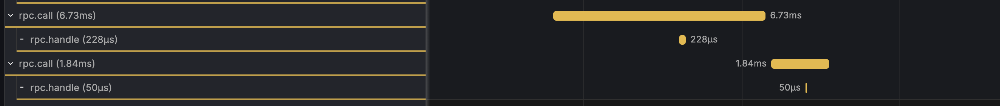
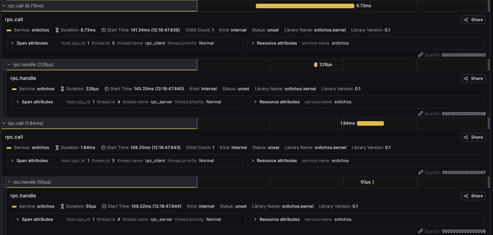

# Post 28 — Two processes, one trace

- post 27 ended with a promise: the scheduler had learned to take the CPU and to choose who gets it, and next it would learn to *let go of it on purpose, and wake back up when someone calls*. that's v0.9 — IPC over capabilities, two processes that actually talk. the headline i was building toward is a single trace that crosses a *process* boundary: one program calls, another answers, and you watch the whole conversation as one tree. i got there. but the two things i'll remember from this milestone are a bug the trace *caught* that i'd never have seen otherwise, and a one-word design note from a reviewer that turned a hack i was about to ship into the cleanest idea in the kernel.

## letting go on purpose

- a synchronous endpoint is a rendezvous. a sender calls `send`; if no receiver is waiting it *blocks* — off the run queue entirely — and the message goes nowhere until a receiver shows up. when one calls `receive`, the kernel copies the message straight across and wakes the sender. no buffers, no queues of bytes, no kernel memory that grows: a blocked sender is just a parked thread. backpressure for free.
- the rule that makes it tractable is an invariant: an endpoint never holds senders *and* receivers at once. the instant both exist they rendezvous and both proceed. so at rest it's in exactly one of three states — idle, senders-waiting, receivers-waiting — and the whole thing is a tiny pure state machine i host-tested off-target before any of it touched a CPU, the same way every `kernel-core` decision gets written.
- the actual *blocking* is the new muscle. for four milestones the scheduler had two ways for a task to leave the CPU: `yield_now` (save my registers, re-enqueue me, run someone else) and `exit_now` (don't save anything, don't re-enqueue me, never come back). `block_current` is the third sibling, and it's the missing corner of the table: *don't* re-enqueue me (like exit), but *do* save my context (like yield), because i'm coming back — just not until someone wakes me. `wake` is the inverse: flip a blocked task back to ready and drop it on the run queue. the only subtlety is idempotence — a wake that races a task already running must be a no-op, or you double-enqueue the same task and corrupt the queue. one pure guard, one host test.

## the trace that doesn't line up

- the point of this whole box is that you can see everything, and IPC is where "everything" gets its best demo: the trace context travels *with* the message, kernel-populated, so userspace can't forget it and can't forge it. the sender's open span rides along in the rendezvous; the kernel seeds it onto the receiver, and the receiver's handling span opens as a *child* of the sender's. two processes, one trace, attributed across the boundary by the `thread.name` the kernel already stamps. it works on the first try and it's genuinely the thing i built the project to show.
- and then i looked at it in Tempo and something was off. the parent-child *edge* was right — `ipc.recv` descended from `ipc.send` — but on the *timeline* the two bars didn't overlap at all. the child started a full second *after* the parent had already closed. that's not the nested flame-graph shape you expect from a call; it's two disjoint events linked by a thread. which is, on reflection, *exactly correct* for a one-way send: the sender returns the instant the message is handed off — it doesn't wait for the receiver to do anything — so its span closes immediately, long before the receiver gets a turn. fire-and-forget *should* look disjoint. the trace was telling me the truth about the primitive i'd built.

## the one-second gap

- but *one second* was suspiciously round. the rendezvous itself is microseconds. so where did a full second of real time go between the sender handing off and the receiver waking up to handle it?
- the trace had caught a scheduling bug. the timer fires once per second (it's the heartbeat tick), and the idle loop sleeps with `wfi` — halt the hart until an interrupt. when the rendezvous woke the receiver, `wake` did its job: marked it ready, dropped it on the run queue. but the hart had *already* gone into `wfi`, and `wake` has no way to shake a sleeping hart — only an interrupt does that. so the receiver sat there, runnable, while the hart slept until the *next timer tick* a second later finally broke the `wfi` and the scheduler noticed the work. the IPC was instant; the receiver just couldn't get *scheduled* for up to a second.
- the fix is embarrassingly small once you see it: a hart must never `wfi` while its run queue has ready work. the idle loop now checks before it sleeps. but i want to be honest about *how i found it* — i did not reason my way to it. i saw a number on a trace that didn't match the physics, and pulled the thread. the observability layer i'd spent twenty-seven posts building caught a latency bug in the very feature i was using to demo it. that's the whole thesis paying off in one screenshot: you don't infer that your scheduler is stranding tasks, you *look* and the gap is right there.
- (the same class of bug across *harts* — waking a task whose home hart is asleep — needs an IPI to kick the sleeper, and that's deferred. but the single-hart case, which is where the demo lives, is the idle-loop guard, and it made the whole suite faster as a bonus: a lot of wasted second-long `wfi` naps just evaporated.)

## RPC needs a capability

- one-way messages are the workhorse, but the obvious next question is request/response: a client asks, a server answers. and that's where it gets interesting, because *answering* turns out to require authority the server doesn't have yet. the client `call`s and blocks; the server `receive`s the request — but how does it reply to *this specific* caller, exactly once, without being handed the power to impersonate the caller or reply twice or hold the channel open forever? the answer is a **reply capability**: at the rendezvous the kernel mints a one-shot cap that names the blocked caller and hands it to the server. the server `reply`s through it, the caller wakes with the response, and the cap is consumed. this is the project's first *cross-process* cap-transfer — the kernel reaching into one process's capability table and inserting a cap on another's behalf.
- here's the part i'm glad i didn't ship the way i first wrote it. my first cut had a `revoke()` on the capability table — free the slot, so a looping server doesn't leak a cap per request — and i was pleased with myself for "finally using the generation field" that's sat unused in `Handle` since v0.7b. a reviewer asked the right flat question: *why do we need revoke?* and the honest answer was that i'd reached for a mechanism when i should have reached for a *concept*. the reply cap isn't a thing you revoke; it's a **single-use capability** — affine, used at most once, *consumed* on invocation. once you name it that, `revoke` stops being a reply-specific hack and becomes the *consume step* of a general idea, the generation bump stops being dead weight and becomes the thing that stops a stale handle aliasing the reused slot, and "multiplicity" — persistent vs once — joins "rights" as a property of a grant. same code, almost exactly; completely different *story*. i'd built the lock before noticing i was holding the key. the lesson is one i keep relearning: when a mechanism feels slightly off, check whether you've named the concept yet.

## now the trace nests

- and the payoff loops back to the gap from earlier. with one-way `send` the sender doesn't wait, so the spans are disjoint. but `call` *blocks the caller across the entire round-trip* — the caller's span stays open the whole time the server is working — so the server's handling span opens and closes *inside* the caller's. the timeline finally nests: parent bar wraps child bar, the flame-graph shape, "A is waiting on B" rendered as real, visible latency. the mechanism that propagates the trace is identical to the one-way case; what changed the *shape* is the blocking discipline of the primitive. i wrote a scenario that asserts the temporal containment — and deliberately, it's an assertion the one-way `send` shape *cannot* pass. the difference between fire-and-forget and a call is now a thing the test suite checks, not a thing i eyeball.

## the first call pays for everyone

- put the two round-trips side by side and the first one is *visibly* the expensive one: `rpc.call` 6.73ms with a 228µs `rpc.handle`, versus the second's 1.84ms with a 50µs handle. both halves got ~3–4× faster the second time around, and the trace tells you *why* without a profiler.
- the **handle** shrank (228µs → 50µs) because of span-name interning. the *first* time a span named `rpc.call`/`rpc.handle` opens, the kernel interns the name and ships a `StringRegister` frame down the polled — not cheap — virtio TX *before* the `SpanStart`. the second handle reuses the interned name: one fewer frame on the hot path. a cold `span_open` literally costs an extra round of telemetry, and you can watch it.
- the **call** shrank (6.73ms → 1.84ms) because of server warmup. the gap between the client opening `rpc.call` and the server opening `rpc.handle` is ~4ms on the first call (141.34ms → 145.33ms) and ~1ms on the second. on the first call the server process is still coming up — crt0, its first lazy heap `map_anon`, climbing into the `reply_recv` loop — so the request waits in the endpoint until the server is ready to receive. by the second call the server is already parked in `reply_recv` and the rendezvous is near-instant.
- and the number that *neither* of these is: compute. the actual work is 50–228µs; the round-trip is 1.84–6.73ms. it's scheduling latency end to end — "client blocks, server gets scheduled, replies, client wakes" on one cooperative hart. the trace didn't just confirm the RPC works; it handed me the cold-start cost breakdown for free, in span durations i never instrumented for.

## the fast path that earned its keep

- a real server loop shouldn't pay two syscalls per request — one to reply the last client, one to receive the next. L4 kernels fuse them into a single `reply_recv`, and so does this one now: reply the previous caller and block for the next request in one trap. it's mostly composition of the reply half and the receive half i already had, so the interesting part wasn't writing it — it was that the *looping* server it enables is what finally *stressed* the single-use machinery. the one-shot demo mints exactly one reply cap and never reuses a slot; a server in a loop mints and consumes one *per request*, so the second reply cap reuses the first's freed slot at a bumped generation, the third reuses it again, and so on. the slot-reuse and the generation guard i'd written back in the single-use step had never actually been exercised under load until there was a loop to drive them. the fast path and the stress test were the same feature.

## what i learned

- **the observability layer caught a bug in the feature i was demoing with it.** i did not reason out the one-second wakeup latency; i saw a trace whose timing didn't match physics and pulled the thread. twenty-seven posts of "you can watch everything" justified themselves the moment "everything" included a scheduling bug i'd never have suspected. building the instrument *is* the debugging strategy.
- **a disjoint trace was the primitive telling the truth.** the spans not lining up wasn't a tracing bug — it was the honest shape of fire-and-forget. before you "fix" a visualization that looks wrong, ask whether it's correctly showing you something you didn't want to be true. one-way and request/response *should* look different on the wire, and now they provably do.
- **reach for the concept before the mechanism.** i built `revoke()` for reply caps and felt clever about the generation field. naming the actual idea — *single-use capability* — turned a special-case hack into a general primitive with the same code, and gave three previously-arbitrary pieces (revoke, generation, multiplicity) a single coherent reason to exist. when a mechanism feels slightly bespoke, you probably haven't named the concept it's an instance of.
- **what the caller is allowed to *know* is a security decision.** when a syscall is refused, the rich reason goes to the *observer* on the wire; the *caller* gets a single opaque "denied" bit. that's deliberate — telling a caller "this cap doesn't exist" versus "exists but you lack the right" is the 403-vs-404 leak that lets it probe the system. least authority extends to least *information*. the reason isn't lost, it's *routed* — full detail to the trusted watcher, one bit to the untrusted asker.
- **the fast path was the only thing that tested the slow path's storage.** the single-use slot-reuse sat unexercised until `reply_recv` made a looping server idiomatic. sometimes the feature that stresses your machinery is a later, unrelated-looking one — and "i wrote the reuse logic" and "the reuse logic has ever actually run twice" are different claims.
- **cold starts are visible, not inferred.** the first RPC round-trip ran 3–4× slower than the second, and the trace decomposed it for me without a profiler: name-interning on the cold `span_open`, plus the server still booting into its receive loop, plus scheduling latency dwarfing the 50µs of actual work. i didn't reach for a tool; the warmup tax was sitting right there in the span durations. the milestone's recurring theme again — the instrument keeps answering questions i didn't think to ask.

## what's next

- **v0.10: a filesystem in userspace, behind a trait.** the deliverable isn't the storage — it's the `Filesystem` interface (`open`/`read`/`write`/`stat`) with a trivial RAM-backed implementation behind it, reached *only* through capabilities, talked to *only* over the IPC this milestone just built. the first time the kernel's IPC carries a real protocol instead of a demo's sentinel.
- and a thing post 27 promised that finally has a home: **priority inheritance** — a high task blocked on a low task's resource lending it priority so it doesn't get stuck behind a medium one. that needs a *resource to block on*, and until now there wasn't one. IPC is that resource. i didn't build it this milestone — the demos don't yet have the three-priority pileup that makes inversion bite — but for the first time it's buildable, sitting one workload away. the scheduler learned to take the CPU, to rank who gets it, and now to let go and wake when called. teaching it to *lend* its rank across a blocked call is the next turn of the same screw.
